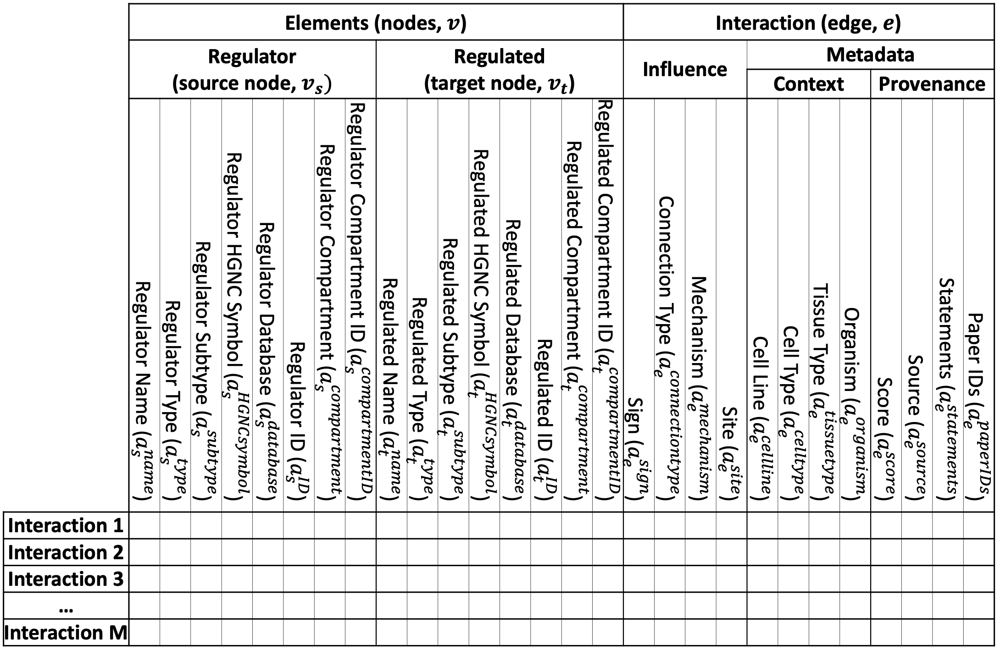

#################
Interaction lists
#################

In the BioRECIPE format, interactions can be represented using *event-based* interaction list format where each individual interaction (biological event) is assigned one row. The column headers match interaction attribute names. 

An example biological interaction, represented as a directed signed edge between two nodes, including node, edge, context, and provenance attributes is illustrated in the figure below (subscripts: *s* - source node, *t* - target node, *e* - edge). 

.. figure:: figures/figure_example_bio_interaction.png
    :align: center
    :alt: internal figure
    
|
|

Example of an interaction list in the BioRECIPE format (current version supports one source node and one target node in each interaction):

|

As illustrated in the table above, the BioRECIPE representation of an interaction allows for many interaction attributes to be included. Each attribute belongs to one of the following groups:

- basic node attributes
- basic edge attributes
- context attributes
- provenance attributes

The following tables provide details for each attribute, including attribute name used in the BioRECIPE spreadsheet, a symbol used in detailed definitions, a brief description of the attribute, allowed values, and a few examples. Additional interaction examples can be found here (*TODO, this should be a link to examples folder).  

|

Basic element attributes
-------------------------

.. csv-table:: 
    :header: Attribute, Symbol, Description, Values, Examples
    :widths: 5, 3, 34, 38, 20

    Name, ":math:`a^{\mathrm{name}}`", a common name of a biological component used by experts, <element name>, "ERK1, RAS, p53"
    Type, ":math:`a^{\mathrm{type}}`", biological component type, ``protein`` | ``gene`` | ``chemical`` | ``RNA`` | ``protein family`` | ``biological process``, listed under Values
    Subtype, ":math:`a^{\mathrm{subtype}}`", element subtype provides additional details for curation, ``receptor`` | <subtype name>, "??"
    HGNC ID, ":math:`a^{\mathrm{HGNC_ID}}`", the corresponding gene symbol from the HGNC database, <HGNC unique gene symbol>, "BCL2L1, APAF1"
    Database, ":math:`a^{\mathrm{database}}`", a database where the element ID is found, ``UniProt`` | ``HGNC`` | ``PubChem`` | {``Ensembl`` | ``GENCODE`` | ``RefSeq``} | {``Pfam`` | ``InterPro``} | {``GO`` | ``MeSH``}, listed under Values
    ID, ":math:`a^{\mathrm{ID}}`", unique element ID from an open access database, "<unique identifier> {, <unique identifier>}", "Q07817, O14727"
    Compartment, ":math:`a^{\mathrm{compartment}}`", cellular compartment name, ``cytoplasm`` | ``cytosol`` | ``plasma membrane`` | ``nucleus`` | ``mitochondria`` | ``endoplasmic reticulum`` | ``extracellular``, listed under Values
    Compartment ID, ":math:`a^{\mathrm{compartmentID}}`", cellular compartment unique identifier from the GO database,``0005737`` | ``0005829`` | ``0005886`` | ``0005634`` | ``0005739`` | ``0005783`` | ``0005576``, identifiers are listed under Values in the same order as compartment names
  
|  

Basic interaction attributes
-----------------------------

.. csv-table:: 
    :header: Attribute, Symbol, Description, Values, Examples
    :widths: 5, 3, 34, 38, 20

    Direction, ":math:`a^{\mathrm{direction}}`", this is an implicit attribute, determined as a direction from source to target node 
    Sign, ":math:`a^{\mathrm{sign}}`", interaction sign (also referred to as “polarity”) indicates positive or negative influence, ``positive`` | ``negative``, listed under Values
    Connection Type, ":math:`a^{\mathrm{connectiontype}}`", "indicates whether the edge between the source and target nodes represents direct physical interaction between elements, or it is expected or known that there is a path of several connected interactions between the source node and target node", ``direct`` | ``indirect``, listed under Values
    Mechanism, ":math:`a^{\mathrm{mechanism}}`", "indicates the exact physical interaction, i.e., biological mechanism; value usually included when the Connection Type is direct", ``binding`` | ``phosphorylation`` | ``dephosphorylation`` | ``ubiquitination`` | ``deubiquitination`` | ``acetylation`` | ``deacetylation`` | ``methylation`` | ``demethylation`` | ``transcription`` | ``translation`` | ``translocation``, listed under Values
    Site, ":math:`a^{\mathrm{site}}`", molecular site where the interaction occurs, <molecular site name>, "T308, T450, S473"

|

Context attributes
------------------

.. csv-table:: 
    :header: Attribute, Symbol, Description, Values, Examples
    :widths: 5, 3, 34, 38, 20

    Cell Line, ":math:`a^{\mathrm{cellline}}`", cell line where the interaction is observed, <cell line name>, "GS6-22 (glioblastoma multiforme (GBM) cell line)" 
    Cell Type, ":math:`a^{\mathrm{celltype}}`", cell type where the interaction is observed, <cell type name>, "T cell, macrophage, pancreatic cancer cell, GBM cell"
    Tissue Type, ":math:`a^{\mathrm{tissuetype}}`", tissue type where the interaction is observed, <tissue type name>, "pancreas, colon, brain"
    Organism, ":math:`a^{\mathrm{organism}}`", organism where the interaction is observed, <organism name>, "human, mouse"

|

Provenance attributes
---------------------

.. csv-table:: 
    :header: Attribute, Symbol, Description, Values, Examples
    :widths: 5, 3, 34, 38, 20

    Score, ":math:`a^{\mathrm{score}}`", confidence in interaction, <number>, "a number in the interval [0,1] for sources like INDRA or STRING; present/absent for PCnet"
    Source, ":math:`a^{\mathrm{source}}`", knowledge or data source where the interaction is found, ``expert`` | ``literature`` | ``database`` | ``data``, listed under Values
    Statements, ":math:`a^{\mathrm{statements}}`", statements (sentences) where the interaction is found, "<text>; {<text>;}", “Bcl-XL interacts with Apaf-1 and inhibits Apaf-1-dependent caspase-9 activation”
    Paper IDs, ":math:`a^{\mathrm{paperIDs}}`", "if literature, paper IDs where the interaction is found", "<PMCID | PMID> {,<PMCID | PMID>}", PMID9539746

|

Other attribute definitions
---------------------------

.. csv-table::
    :header: Name, Definition
    :widths: 9, 40

    <element name>, "user-defined, typically a commonly used name for the biological species or component"
    <subtype name>, "user-defined, used to specify element beyond just its type"
    <HGNC unique gene symbol>, "a gene symbol from the HGNC database that corresponds to the element"
    <molecular site name>, "commonly used molecular site symbol"
    <cell line name>, "assigned name of a cell line"
    <cell type name>, "commonly used cellular type name"
    <tissue type name>, "commonly used tissue type name"
    <organism name>, "commonly used organism name"
    <PMCID | PMID>, "unique paper PMCID or PMID"
    <number>, "just a number"
    <text>, "any text"

