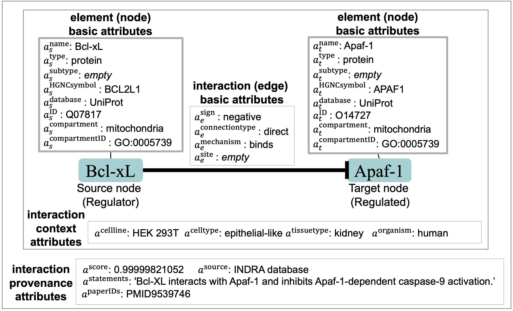

######################################
Biological Interactions
######################################

The BioRECIPE format includes several groups of attributes:

- node attributes
- edge attributes
- context attributes
- provenance attributes

An example biological interaction represented as a directed signed edge between two nodes, including node, edge, context, and provenance attributes is shown in the figure below.

The BioRECIPE format can be used to represent interactions obtained from different sources:

- retrieved from text using natural language processing
     Example: “TNFa reduces BMPR-II expression in vitro and in vivo” -  a reading engine extracts the interaction “TNFa negatively regulates BMPR-II”.
- retrieved from interaction databases
     Example: From the STRING database, an interaction between TRADD and TNF is predicted with high confidence.
     Note: the interaction is missing direction information, to determine source and target nodes; additional information is needed
- inferred from data
     Example: "STAMBP deubiquitinates TNFRSF1A" (source: BioGRID)
- entered manually by experts
    Example: "NOTCH positively regulates stemness."

The attribute values for interactions are written according to the following syntax. (*TODO: a^Variable is now added but documentation is missing*)

.. csv-table:: Element (node) attributes
    :header: Attribute, Value Instances
    :widths: 9, 40

    ":math:`a^{\mathrm{name}}`", <element name>
    ":math:`a^{\mathrm{type}}`", ``protein`` | ``gene`` | ``chemical`` | ``RNA`` | ``protein family`` | ``biological process``
    ":math:`a^{\mathrm{subtype}}`", ``receptor`` | <subtype name>
    ":math:`a^{\mathrm{HGNC_ID}}`", <HGNC unique gene symbol>
    ":math:`a^{\mathrm{database}}`", ``UniProt`` | ``HGNC`` | ``PubChem`` | {``Ensembl`` | ``GENCODE`` | ``RefSeq``} | {``Pfam`` | ``InterPro``} | {``GO`` | ``MeSH``}
    ":math:`a^{\mathrm{ID}}`", "<unique identifier> {, <unique identifier>}"
    ":math:`a^{\mathrm{compartment}}`", ``cytoplasm`` | ``cytosol`` | ``plasma membrane`` | ``nucleus`` | ``mitochondria`` | ``endoplasmic reticulum`` | ``extracellular``
    ":math:`a^{\mathrm{compartmentID}}`", ``0005737`` | ``0005829`` | ``0005886`` | ``0005634`` | ``0005739`` | ``0005783`` | ``0005576``

.. csv-table:: Interaction (edge) attributes
    :header: Attribute, Value Instances
    :widths: 9, 40

    ":math:`a^{\mathrm{sign}}`", ``positive`` | ``negative``
    ":math:`a^{\mathrm{connectiontype}}`",``D`` | ``I``
    ":math:`a^{\mathrm{mechanism}}`", ``binding`` | ``phosphorylation`` | ``dephosphorylation`` | ``ubiquitination`` | ``acetylation`` | ``methylation`` | ``transcription`` | ``translocation`` | ``transcription`` | ``translation``
    ":math:`a^{\mathrm{site}}`", <molecular site name>

.. csv-table:: Context attributes
    :header: Attribute, Value Instances
    :widths: 9, 40

    ":math:`a^{\mathrm{cellline}}`", <cell line name>
    ":math:`a^{\mathrm{celltype}}`", <cell type name>
    ":math:`a^{\mathrm{tissuetype}}`", <tissue type name>
    ":math:`a^{\mathrm{organism}}`", <organism name>

.. csv-table:: Evidence attributes
    :header: Attribute, Value Instances
    :widths: 9, 40

    ":math:`a^{\mathrm{score}}`", "<number>"
    ":math:`a^{\mathrm{source}}`", "``expert`` | ``literature`` | ``database`` | ``data``"
    ":math:`a^{\mathrm{statements}}`", "<text>; <text>; <text>; ...; <text>"
    ":math:`a^{\mathrm{paperIDs}}`", "<PMCID | PMID>, <PMCID | PMID>, ..., <PMCID | PMID>"

.. csv-table:: Name description
    :header: Name, Description
    :widths: 9, 40

    <element name>, "<name> //user-defined, typically a commonly used name for the biological species or component"
    <subtype name>, "<name> //user-defined, used to specify element beyond just its type"
    <unique DB identifier>,
    <molecular site name>,
    <cell line name>,
    <cell type name>,
    <tissue type name>,
    <organism name>,
    <number>,
    <text>,
    <PMCID | PMID>,

In the following, we provide formal definitions of the components of a biological interaction, and the attributes of these components. We also include additional details about attributes and examples of their values.

.. admonition:: Definition 1

 An element(node), :math:`v=v(\mathbf{a}^v)`, is defined by its name, type, and unique identifier (ID) and these attributes are written as a vector :math:`\mathbf{a}^v=(a^{\mathrm{name}},a^{\mathrm{type}},a^{\mathrm{ID}})`.

The attribute :math:`a^{\mathrm{name}}` is an element name, usually following the standard nomenclature used by biologists and in the literature (e.g., acronym ERK1 is used instead of a longer name “extracellular signal-regulated kinase 1”). The attribute :math:`a^{\mathrm{type}}` represents element type, usually genes, RNAs, proteins, chemicals, or biological processes. Biological entity names often have multiple synonyms (e.g., ERK1 may also be referred to as MAPK3), and therefore, unique identifiers (IDs) are used, which are stored in attribute :math:`a^{\mathrm{ID}}`. These IDs can be obtained from standard databases such as UniProt, PubChem, or the Gene Ontology Databases (GO). The unique ID attribute is often written as two attributes, the name of the database from which the ID is retrieved, :math:`a^{\mathrm{database}}`, and the ID, :math:`a^{\mathrm{ID}}`. We will use an additional ID attribute, the gene symbol from the HGNC database, as this is recognized by experts, in contrast to e.g., numbers used by UniProt, and therefore, it can assist in human-driven curation.

In addition to these three required attributes, the node attribute vector :math:`a^v` may also include other attributes that help describe the element. For example, attributes :math:`a^{\mathrm{location}}` and :math:`a^{\mathrm{locationID}}` hold information about the cellular compartment where the element is found and the compartment ID, respectively. We use the GO database to obtain these location IDs. A subtype attribute, :math:`a^{\mathrm{subtype}}`, may be used to indicate additional type of an element, such as :math:`a^{\mathrm{subtype}}` = ``receptor`` for an element with :math:`a^{\mathrm{type}}` = ``protein``. Additionally, the unique ID attribute may be split into two attributes, the name of the database from which the ID is retrieved, :math:`a^{\mathrm{database}}`, and the ID, :math:`a^{\mathrm{ID}}`.

.. admonition:: Definition 2

 A directed signed interaction (also referred to as a directed edge) :math:`e=e(v_s,v_t,\mathbf{a}^e)` is defined with its source element :math:`v_s`, target element :math:`v_t`, and vector of attributes :math:`a^e`. The interaction attribute vector always includes at least the sign :math:`a^{\mathrm{sign}}` and connection type :math:`a^{\mathrm{connectiontype}}` attributes: :math:`\mathbf{a}^e=(a^{\mathrm{sign}},a^{\mathrm{connectiontype}})`. The direction of an interaction is always implicitly defined with source and target nodes, and therefore, not explicitly listed among its attributes.

The :math:`a^{\mathrm{sign}}` attribute indicates the sign (also referred to as polarity) of the influences, and it can take two values, :math:`a^{\mathrm{sign}}` = ``positive`` (e.g., activation) or :math:`a^{\mathrm{sign}}` = ``negative`` (e.g., inhibition). Sometimes, only the information about indirect influences on pathways of interest is known, and therefore, the attribute :math:`a^{\mathrm{connectiontype}}` is used to indicate whether the interaction :math:`e` is a direct physical interaction (:math:`a^{\mathrm{connectiontype}}` = ``direct``) or an indirect influence from the source node to the target node (:math:`a^{\mathrm{connectiontype}}` = ``indirect``). Since the interaction definition allows for indirect interactions, it is possible that source and target node are not in the same compartment, and this is the reason we assign the location attribute to nodes and not to the interaction.

The list of other attributes is not necessarily fixed; the components in it may vary, dependent on the goals of the analysis. A more specific information about the biological mechanism and the molecular site of an interaction can be included in the :math:`a^{\mathrm{mechanism}}` and the :math:`a^{\mathrm{site}}` attributes, respectively. We note here that, in some cases, :math:`a^{\mathrm{sign}}` is not explicitly stated in statements about influences that describe mechanisms (e.g., A phosphorylates B). In this case, it would be up to the user to either fill in this information from other sources or accept a default attribute assignment. For example, the default assignment could be ``positive`` for phosphorylation, although this may not always be the case, and would require curation.

The edge attribute vector can also include the :math:`a^{\mathrm{cellline}}`, :math:`a^{\mathrm{celltype}}`, :math:`a^{\mathrm{tissuetype}}`, :math:`a^{\mathrm{organism}}` attributes, which hold the context information about the cell line, cell type, tissue type, and organism where the interaction is observed, respectively.

Finally, provenance attributes can be used. The :math:`a^{\mathrm{score}}` attribute provides a summary score for confidence in the interaction, or the amount of available evidence for the interaction. The :math:`a^{\mathrm{source}}` attribute indicates the source of evidence, which can be literature, expert knowledge, databases, or data. The :math:`a^{\mathrm{statements}}` attribute is used to store the statements, parts of sentences or sentences where the interaction is mentioned. The :math:`a^{\mathrm{paperIDs}}` attribute holds paper IDs (e.g., PMCID) where the sentences mentioning the interaction are found. When the information about the additional non-essential attributes is not available, these attributes are assigned an “empty” value.

.. csv-table:: All attributes
    :header: Attribute, Definition, Description, Example
    :widths: 8, 8, 20, 20

    ":math:`a^{\mathrm{name*}}`",  , "element name, could be informal, typically used by experts", "RAS; ERK1; p53"
    ":math:`a^{\mathrm{type*}}`",  , "element type", "protein; protein family; RNA; gene; chemical; biological process"
    ":math:`a^{\mathrm{subtype}}`",  , "element subtype provides additional details for curation", "receptor"
    ":math:`a^{\mathrm{HGNCID}}`",  , "the gene symbol from the HGNC database", "BCL2L1; APAF1"
    ":math:`a^{\mathrm{database*}}`",  , "a database where the element ID is found", "UniProt; Pfam; Ensembl; HGNC; PubChem; GO"
    ":math:`a^{\mathrm{ID*}}`",  , "unique element ID from an open access database", "Q07817; O14727"
    ":math:`a^{\mathrm{compartment}}`",  , "cellular compartment name", "cytoplasm; plasma membrane; nucleus"
    ":math:`a^{\mathrm{compartmentID}}`",  , "cellular compartment unique identifier from the GO database", "0005737; 0005886; 0005634 "
    ":math:`a^{\mathrm{direction*}}`",  , "interaction direction", "this is an implicit attribute, determined as a direction from source to target node"
    ":math:`a^{\mathrm{sign*}}`",  , "interaction sign (also referred to as *polarity*) indicates positive or negative influence", "positive; negative"
    ":math:`a^{\mathrm{connectiontype}}`",  , "interaction connection type can be: *direct* (*D*), indicating that the edge between the source and target nodes represents direct physical interaction between elements; *indirect* (*I*), indicating that it is expected or known that there is a path of several connected interactions between the source node and target node", "D; I"
    ":math:`a^{\mathrm{mechanism}}`",  , "interaction mechanism indicates the exact physical interaction (biological mechanism); value usually included when a^connectiontype=*D*; ", "binding; phosphorylation; ubiquitination"
    ":math:`a^{\mathrm{site}}`",  , "molecular site where the interaction occurs", "T308; T450; S473  (phosphorylation sites for Akt)"
    ":math:`a^{\mathrm{cellline}}`",  , "cell line where the interaction is observed", "GS6-22 (glioblastoma multiforme (GBM) cell lines) "
    ":math:`a^{\mathrm{celltype}}`",  , "cell type where the interaction is observed", "T cell; microphage; pancreatic cancer cell; GBM cell"
    ":math:`a^{\mathrm{tissuetype}}`",  , "tissue type where the interaction is observed", "pancreas; colon; brain"
    ":math:`a^{\mathrm{organism}}`",  , "organism where the interaction is observed", "human; mouse"
    ":math:`a^{\mathrm{score}}`",  , "confidence in interaction, e.g., interval 0-1 (INDRA, STRING), present/absent (PCnet) ", "0.18"
    ":math:`a^{\mathrm{source}}`",  , "knowledge source(s) where the interaction is found", "Literature; expert; data"
    ":math:`a^{\mathrm{statements}}`",  , "statements (sentences) where the interaction is found", "Bcl-XL interacts with Apaf-1 and inhibits Apaf-1-dependent caspase-9 activation"
    ":math:`a^{\mathrm{paperIDs}}`",  , "if literature, paper IDs where the interaction is found", "PMID9539746"
