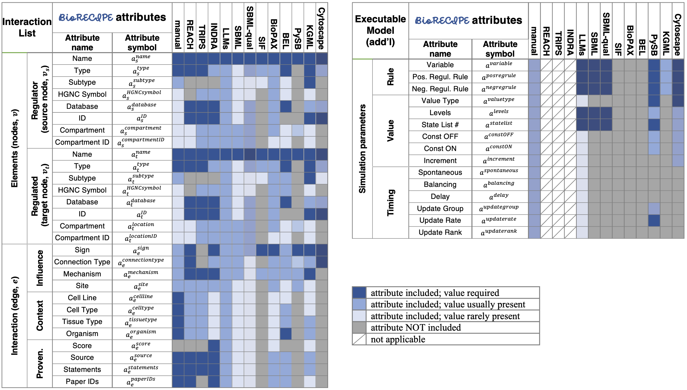

#############################
Compatibility and translators
#############################

The BioRECIPE format is compatible with a range of representation formats, databases, and tools, either directly, or through translation. 

Attribute compatibility
-----------------------
Here we provide an overview of which attributes that BioRECIPE considers are included in other representation formats, output by several tools, including LLMs, or input in models by human curators. Note: additional standards, databaes, and tools are listed in the following section.

|

Translators
-----------

The tables below list example formats, databases, and tools and links to translators. The translator repositories provide further instructions for the use of translators.

| 

.. csv-table:: Formats compatible with BioRECIPE
    :header: Standard, Format, To BioRECIPE, From BioRECIPE, Description
    :widths: 8, 8, 9, 9, 66

    SBML, RDF/XML, ✓, ✓, `Translation <https://github.com/pitt-miskov-zivanov-lab/BioRECIPE/tree/main/translators/sbml>`_ to BioRECIPE Executable Model and from BioRECIPE Interaction List 
    SBML-qual, RDF/XML, ✓, ✓, `Translation <https://github.com/pitt-miskov-zivanov-lab/BioRECIPE/tree/main/translators/sbmlqual>`_ to and from BioRECIPE Executable Model
    SIF, TXT, ✓, ✓, `Translation <https://github.com/pitt-miskov-zivanov-lab/BioRECIPE/tree/main/translators/SIF>`_ to and from BioRECIPE Interaction List and from BioRECIPE Executable Model
    BioPAX, "RDF/OWL, SBML", ✓, ✓, `Translation <https://github.com/pitt-miskov-zivanov-lab/BioRECIPE/tree/main/translators/sbml>`_ from and to BioPAX files can be done through SBML translation to and from BioRECIPE
    BEL, TXT (INDRA), ✓, ✓, Translation from and to `BEL statements <https://github.com/pybel/pybel>`_ through `INDRA statements <https://indra.readthedocs.io/en/latest/modules/sources/bel/index.html>`_
    PySB, SBML, ✓, ✓, `Translation <https://github.com/pitt-miskov-zivanov-lab/BioRECIPE/tree/main/translators/sbml>`_ from and to `PySB files <https://pysb.readthedocs.io/en/stable/modules/export/sbml.html>`_ can be done through the SBML translation to and from BioRECIPE 
    REACH, CMU format, ✓, N/A, `Translation <https://github.com/pitt-miskov-zivanov-lab/BioRECIPE/tree/main/translators/BioRECIPE%20Interactions>`_ from REACH CMU format to BioRECIPE interaction List
    TRIPS, XML, ✓, N/A, `Translation <https://github.com/pitt-miskov-zivanov-lab/BioRECIPE/tree/main/translators/REACH_TRIPS>`_ from TRIPS output to BioRECIPE Interaction List

|

.. csv-table:: Databases compatible with BioRECIPE
    :header: Database, Format, To BioRECIPE, From BioRECIPE, Description
    :widths: 8, 8, 9, 9, 66

    `KEGG <https://www.genome.jp/kegg/>`_, "KGML, SBML", ✓, ✓, Translation from and to `KGML files <https://github.com/draeger-lab/KEGGtranslator>`_ through the SBML translation to and from BioRECIPE
    `REACTOME <https://reactome.org/>`_, "SBML, BioPAX", ✓, ✓, See `SBML <https://github.com/pitt-miskov-zivanov-lab/BioRECIPE/tree/main/translators/sbml>`_ and BioPAX translation
    `Pathway Commons <https://www.pathwaycommons.org/pc2/formats>`_, "SIF, BioPAX", ✓, ✓, See `SIF <https://github.com/pitt-miskov-zivanov-lab/BioRECIPE/tree/main/translators/SIF>`_ and BioPAX translation
    `NDEx <https://home.ndexbio.org/network-formats/>`_, "SIF, BEL(INDRA), BioPAX", ✓, ✓, See `SIF <https://github.com/pitt-miskov-zivanov-lab/BioRECIPE/tree/main/translators/SIF>`_ BEL and BioPAX translation
    `BioModels <https://www.ebi.ac.uk/biomodels/>`_, "SBML, SBML-qual", ✓, ✓, See `SBML <https://github.com/pitt-miskov-zivanov-lab/BioRECIPE/tree/main/translators/sbml>`_ and `SBML-qual <https://github.com/pitt-miskov-zivanov-lab/BioRECIPE/tree/main/translators/sbmlqual>`_ translation

|

.. csv-table:: External tools compatible with BioRECIPE
    :header: Tool (external), Format, To BioRECIPE, From BioRECIPE, Description
    :widths: 8, 8, 9, 9, 66

    `Cytoscape <https://manual.cytoscape.org/en/stable/Supported_Network_File_Formats.html>`_, "SIF, CX(INDRA)", ✓, ✓, See `SIF translation <https://github.com/pitt-miskov-zivanov-lab/BioRECIPE/tree/main/translators/SIF>`_ or `INDRA translation  <https://github.com/pitt-miskov-zivanov-lab/BioRECIPE/tree/main/translators/indra>`_ and `CX assembler  <https://indra.readthedocs.io/en/latest/modules/assemblers/cx_assembler.html>`_ 
    `Cell Collective <https://cellcollective.org/#>`_, SBML-qual, ✓, ✓, See `SBML-qual translation <https://github.com/pitt-miskov-zivanov-lab/BioRECIPE/tree/main/translators/sbmlqual>`_
    `CellNetAnalyzer <https://www2.mpi-magdeburg.mpg.de/projects/cna/manual_cellnetanalyzer.pdf>`_, SBML, ✓, ✓, See `SBML translation <https://github.com/pitt-miskov-zivanov-lab/BioRECIPE/tree/main/translators/sbml>`_ 
    `CellDesigner <https://www.celldesigner.org/help/CDH_File_07.html>`_, SBML, ✓, ✓, See `SBML translation <https://github.com/pitt-miskov-zivanov-lab/BioRECIPE/tree/main/translators/sbml>`_
    `INDRA <https://indra.readthedocs.io/en/latest/>`_, JSON, ✓, ✓, `Translation <https://github.com/pitt-miskov-zivanov-lab/BioRECIPE/tree/main/translators/indra>`_ to and from BioRECIPE Interaction List
    `REACH <https://github.com/clulab/reach/wiki/Supported-Output-Formats>`_, JSON, ✓, N/A, Translation to BioRECIPE Interaction List directly or through `INDRA <https://github.com/pitt-miskov-zivanov-lab/BioRECIPE/tree/main/translators/indra>`_
    `TRIPS <https://trips.ihmc.us/parser/api.html>`_, XML, ✓, N/A, Translation to BioRECIPE Interaction List directly or through `INDRA <https://github.com/pitt-miskov-zivanov-lab/BioRECIPE/tree/main/translators/indra>`_

|

.. csv-table:: MeLoDy Lab tools compatible with BioRECIPE
    :header: Tool, Description
    :widths: 20, 80

    `DiSH <https://github.com/pitt-miskov-zivanov-lab/dyse_wm>`_, Uses BioRECIPE Executable Model format at input
    `FLUTE <https://melody-flute.readthedocs.io/>`_, Uses BioRECIPE Interaction List format at input and output
    VIOLIN, Uses BioRECIPE Interaction List and Executable Model formats at input and output
    `CLARINET <https://melody-clarinet.readthedocs.io/>`_, Uses BioRECIPE Interaction List and Executable Model formats at input and output
    `ACCORDION <https://melody-accordion.readthedocs.io/>`_, Uses BioRECIPE Interaction List and Executable Model formats at input and output
    PIANO, Uses BioRECIPE Executable Model format at input
    `FIDDLE <https://melody-fiddle.readthedocs.io/>`_, Uses BioRECIPE Interaction List and Executable Model formats at input
    MINUET, Uses BioRECIPE Interaction List format at input and output

