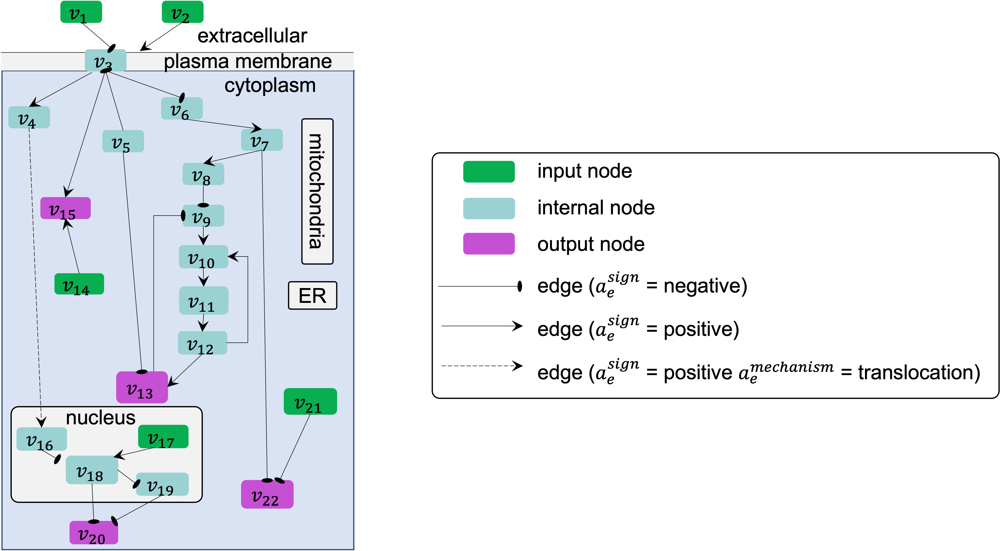

##################
Formal definitions
##################

Directed graph definitions
--------------------------

The components of a directed graph :math:`G(V,E)`, and the attributes of these components relevant for modeling intracellular networks, are defined as follows.

.. csv-table::
    :header: Notation, Definition
    :widths: 10, 90

    ":math:`V=\{v_1,v_2,...,v_N\}`", "a set of :math:`N` nodes :math:`v_i (i=1,...,N)`, each assigned to one model **element**, where each element represents a component of the system being modeled"
    ":math:`E=\{e_1,e_2,...,e_M\}`", "a set of :math:`M` directed edges :math:`e_j (j=1,...,M)`, each assigned to an **interaction** between elements"
    ":math:`v_i=v(\mathbf{a}_i^v)`", "each node :math:`v_i` has an attribute vector :math:`\mathbf{a}^v≡(a^{\mathrm{name}},a^{\mathrm{type}},a^{\mathrm{subtype}},a^{\mathrm{HGNCsymbol}},a^{\mathrm{database}},a^{\mathrm{ID}},a^{\mathrm{compartment}},a^{\mathrm{compartmentID}})`"
    ":math:`e_j=e(V_{s_j},v_{t_j},\mathbf{a}_j^e)`", "each edge :math:`e_j` has one or more source nodes forming a set :math:`V_{s_j}`, a target node :math:`v_{t_j}`, and an attribute vector :math:`\mathbf{a}^e≡(a^{\mathrm{sign}},a^{\mathrm{connectiontype}},a^{\mathrm{mechanism}},a^{\mathrm{site}},a^{\mathrm{cellline}},` :math:`a^{\mathrm{celltype}},a^{\mathrm{tissuetype}},a^{\mathrm{organism}},a^{\mathrm{score}},a^{\mathrm{source}},a^{\mathrm{statements}},a^{\mathrm{paperIDs}})`"

We note here that the BioRECIPE representation format can also be used for undirected graphs - in that case, the distinction between source and target nodes will not be relevant. An undirected graph can be represented in the BioRECIPE format as a `list <https://melody-biorecipe.readthedocs.io/en/latest/bio_interactions.html#interaction-lists>`_ of interactions (edges).

|

Interaction definitions
----------------------------------

In the following, we provide formal definitions of the components of an interaction, and the attributes of these components. We also include additional details about attributes and examples of their values.

.. admonition:: Definition 1 - Element (node)

 An element(node), :math:`v=v(\mathbf{a}^v)`, is defined by its name, type, and unique identifier (ID) and these attributes are written as a vector :math:`\mathbf{a}^v=(a^{\mathrm{name}},a^{\mathrm{type}},a^{\mathrm{database}},a^{\mathrm{ID}})`. These are required element attributes in the BioRECIPE format.

The attribute :math:`a^{\mathrm{name}}` is an element name, usually following the standard nomenclature used by biologists and in the literature (e.g., acronym ERK1 is used instead of a longer name “extracellular signal-regulated kinase 1”). The attribute :math:`a^{\mathrm{type}}` represents element type, usually genes, RNAs, proteins, chemicals, or biological processes. Biological entity names often have multiple synonyms (e.g., ERK1 may also be referred to as MAPK3), and therefore, unique identifiers (IDs) are used, which are stored in attribute :math:`a^{\mathrm{ID}}`. These IDs can be obtained from standard databases such as UniProt, PubChem, or the Gene Ontology Databases (GO). The unique ID attribute is often written as two attributes, the name of the database from which the ID is retrieved, :math:`a^{\mathrm{database}}`, and the ID, :math:`a^{\mathrm{ID}}`. In addition to the required attributes, we include an optional ID attribute, :math:`a^{\mathrm{HGNCsymbol}}`, the gene symbol from the HGNC database, as this is recognized by experts, in contrast to e.g., numbers used by UniProt, and therefore, it can assist in human-driven curation.

The node attribute vector :math:`a^v` may also include other attributes that help describe the element. For example, attributes :math:`a^{\mathrm{location}}` and :math:`a^{\mathrm{locationID}}` hold information about the cellular compartment, where the element is found, and the compartment ID, respectively. We use the GO database to obtain these location IDs. A subtype attribute, :math:`a^{\mathrm{subtype}}`, may be used to indicate additional type of an element, such as :math:`a^{\mathrm{subtype}}` = ``receptor`` for an element with :math:`a^{\mathrm{type}}` = ``protein``.

In element-based modeling of biological systems, an element usually represents a biomolecular species, a chemical, or  a biological process. 

.. admonition:: Definition 2 - Interaction (edge) 

 A directed signed interaction (also referred to as a directed edge) :math:`e=e(v_s,v_t,\mathbf{a}^e)` is defined with its source element :math:`v_s`, target element :math:`v_t`, and vector of attributes :math:`a^e`. The interaction attribute vector always includes at least the sign :math:`a^{\mathrm{sign}}` and connection type :math:`a^{\mathrm{connectiontype}}` attributes: :math:`\mathbf{a}^e=(a^{\mathrm{sign}},a^{\mathrm{connectiontype}})`. The direction of an interaction is implicitly defined with source and target nodes, and therefore, not explicitly listed among its attributes.

The :math:`a^{\mathrm{sign}}` attribute indicates the sign (also referred to as polarity) of the influences, and it can take two values, :math:`a^{\mathrm{sign}}` = ``positive`` (e.g., activation) or :math:`a^{\mathrm{sign}}` = ``negative`` (e.g., inhibition). Sometimes, only the information about indirect influences on pathways of interest is known, and therefore, the attribute :math:`a^{\mathrm{connectiontype}}` is used to indicate whether the interaction :math:`e` is a direct physical interaction (:math:`a^{\mathrm{connectiontype}}` = ``direct``) or an indirect influence from the source node to the target node (:math:`a^{\mathrm{connectiontype}}` = ``indirect``). Since the interaction definition allows for indirect interactions, it is possible that source and target node are not in the same compartment, and this is the reason we assign the location attribute to nodes and not to the interaction.

The list of other attributes is not necessarily fixed; the components in it may vary, dependent on the goals of the analysis. A more specific information about the biological mechanism and the molecular site of an interaction can be included in the :math:`a^{\mathrm{mechanism}}` and the :math:`a^{\mathrm{site}}` attributes, respectively. We note here that, in some cases, :math:`a^{\mathrm{sign}}` is not explicitly stated in statements about influences that describe mechanisms (e.g., A phosphorylates B). In this case, it would be up to the user to either fill in this information from other sources or accept a default attribute assignment. For example, the default assignment could be ``positive`` for phosphorylation, although this may not always be the case, and would require curation.

The edge attribute vector can also include the :math:`a^{\mathrm{cellline}}`, :math:`a^{\mathrm{celltype}}`, :math:`a^{\mathrm{tissuetype}}`, :math:`a^{\mathrm{organism}}` attributes, which hold the context information about the cell line, cell type, tissue type, and organism where the interaction is observed, respectively.

Finally, provenance attributes can be used. The :math:`a^{\mathrm{score}}` attribute provides a summary score for confidence in the interaction, or the amount of available evidence for the interaction. The :math:`a^{\mathrm{source}}` attribute indicates the source of evidence, which can be literature, expert knowledge, databases, or data. The :math:`a^{\mathrm{statements}}` attribute is used to store the statements, parts of sentences or sentences where the interaction is mentioned. The :math:`a^{\mathrm{paperIDs}}` attribute holds paper IDs (e.g., PMCID) where the sentences mentioning the interaction are found. 

Whenever the information about the non-essential attributes is not available, these attributes are assigned an “empty” value.

|

Executable model definitions
----------------------------

All interactions that lead to changes in an element are combined into an update rule for that element. Since these rules can have different mathematical form, for example, logical, discrete, or continuous functions, we also refer to these models as *hybrid element-based models*. 

.. admonition:: Definition 3 - Model structure (static)

 The static structure of models represented with the BioRECIPE format is a directed graph :math:`G(V,E)`, where :math:`V=\{v_1,v_2,...,v_N\}` is a set of nodes, and each node :math:`v_i=v(\mathbf{a}_i^v) (i=1,...,N)` is one model element, while :math:`E=\{e_1,e_2,...,e_M\}` is a set of directed edges, and an edge :math:`e_j=e(v_{s_j},v_{t_j},\mathbf{a}_j^e), (v_{s_j},v_{t_j}\in V,j=1,...,M)` indicates a directed interaction between elements :math:`v_{s_j}` and :math:`v_{t_j}`, in which source node :math:`v_{s_j}` influences target node :math:`v_{t_j}`. Vectors :math:`\mathbf{a}_i^v` and :math:`\mathbf{a}_j^e` are formed following the definitions of node and edge attribute vectors.

.. admonition:: Definition 4 - Input and output nodes

 An input node is a node that is not a target node of any edge in the model, and an output node is a node that is not a source node of any edge in the model. In the graph, input and output nodes are “hanging” from the rest of the model.

.. admonition:: Definition 5 - Path

 We define a path in a model as :math:`n>1` connected edges: :math:`p(v_{s_p},v_{t_p},a^{\mathrm{sign}_p})=(e(v_{k_1}=v_{s_p},v_{k_2},\mathbf{a}_{k_1}^e),e(v_{k_2},v_{k_3},\mathbf{a}_{k_2}^e),...,e(v_{k_n},v_{k_{n+1}}=v_{t_p},\mathbf{a}_{k_n}^e))`. The direction of the path is implicitly defined with the source node :math:`v_{s_p}` and target node :math:`v_{t_p}`. The regulation sign :math:`a^{\mathrm{sign}_p}` is considered positive when the number of negative signs in the set :math:`\{a_{k_1}^{\mathrm{sign}},a_{k_2}^{\mathrm{sign}},...,a_{k_n}^{\mathrm{sign}}\}` is even, and negative when this number is odd. Cycles and feedback loops may be defined in cases where the path source is also the path target, i.e., :math:`p(v_{s_p},v_{s_p},a^{\mathrm{sign}_p})`.

For example, in the following figure, on the path from source node :math:`v_6` to target node :math:`v_{13}`, the number of negative regulations is odd, due to only one negative regulation from node :math:`v_8` to :math:`v_9`, and so the sign of this overall path is negative.

|

.. admonition:: Definition 6 - Element-based executable model

 An element-based executable model is a triple :math:`\mathcal{M}(G,\mathcal{X},\mathcal{F})`, where :math:`G(V,E)` is a static network structure of the model (defined earlier in Definition 3), :math:`\mathcal{X}=\{x_1,x_2,...,x_N\}` is a set of :math:`N` state variables corresponding to nodes in :math:`V=\{v_1,v_2,...,v_N\}`, and :math:`\mathcal{F}=\{f_1,f_2,...,f_N\}` is a set of :math:`N` regulatory (update) functions such that each element :math:`v_i \in V` has a corresponding function :math:`f_i \in \mathcal{F}`.

.. admonition:: Definition 7 - Regulators

 A source node :math:`v_j` of an edge in graph :math:`G(V,E)` that has :math:`v_i` as a target node is called a regulator of :math:`v_i`. In other words, for each element :math:`v_i`, any element :math:`v_j` that influences the state of :math:`v_i` such that the function :math:`f_i` is sensitive to the value of :math:`x_j` is called a regulator of :math:`v_i`.

.. admonition:: Definition 8 - Influence set

 For each element :math:`v_i`, an influence set, denoted as :math:`V_i^{\mathrm{influence}} \in V`, consists of all regulators of :math:`v_i`. The state variables that correspond to the elements in :math:`V_i^{\mathrm{influence}}` form set :math:`\mathcal{X}_i^{\mathrm{influence}}`

.. admonition:: Definition 9 - Positive and negative regulators

 Any element :math:`v_j \in V_i^{\mathrm{influence}}`, for which the edge :math:`e(v_j,v_i,\mathbf{a}^e)` has a positive sign, :math:`a_e^{\mathrm{sign}}` = ``positive``, belongs to the *positive regulator list* for element :math:`v_i`, denoted as :math:`v_j \in V_i^{\mathrm{influence},+} \subset V_i^{\mathrm{influence}}`, represented with attribute :math:`a^{\mathrm{posreglist}}`.  Any element :math:`v_j \in V_i^{\mathrm{influence}}`, for which the edge :math:`e(v_j,v_i,\mathbf{a}^e)` has a negative sign, :math:`a_e^{\mathrm{sign}}` = ``negative``, belongs to the *negative regulator list* for element :math:`v_i`, denoted as :math:`v_j \in V_i^{\mathrm{influence},-} \subset V_i^{\mathrm{influence}}`, represented with attribute :math:`a^{\mathrm{neglist}}`.

.. admonition:: Definition 10 - Element state variable

 For each element :math:`v_i \in V`, its state variable :math:`x_i \in \mathcal{X}` can take any value from a set or an interval of values :math:`X_i`. The state variable :math:`x_i` is represented with attribute :math:`a^{\mathrm{variable}}`, and is assigned either the amount or activity value of :math:`v_i`, represented with attribute :math:`a^{\mathrm{valuetype}}`.

.. admonition:: Definition 11 - Positive and negative regulation rules

 The state variables :math:`x_j` that correspond to elements in :math:`V_i^{\mathrm{influence},+}` form set :math:`X_i^{\mathrm{influence},+} \subset X_i^{\mathrm{influence}}`, and are used for creating a *positive regulation rule* for :math:`v_i`, represented with attribute :math:`a^{\mathrm{posregulation}}`. 
 The state variables :math:`x_j` that correspond to elements in :math:`V_i^{\mathrm{influence},-}` form set :math:`X_i^{\mathrm{influence},-} \subset X_i^{\mathrm{influence}}`, and are used for creating a *negative regulation rule* for :math:`v_i`, represented with attribute :math:`a^{\mathrm{negregulation}}`.

.. admonition:: Definition 8 - Number of levels 

 When :math:`X_i` is a set of discrete values, :math:`|X_i|` is referred to as the number of levels of :math:`v_i`, represented with attribute :math:`a^{\mathrm{levels}}`.

.. admonition:: Definition 15 - 

 An array of :math:`k` state values :math:`X_i^{t_0},X_i^{t_1},X_i^{t_2},...,X_i^{t_{k-1}}` that are assigned to :math:`v_i` at :math:`\{t_0,t_1,t_2,...,t_{k-1}\}` time steps during simulation, where :math:`t_0` is the initial time step, and :math:`t_0<t_1<t_2<...<t_{k-1}`, is called state list and is represented with attribute :math:`a^{\mathrm{statelist}}`.

.. admonition:: Definition 16

 When the state variable :math:`x_i` has a constant 0 value throughout the entire simulation, this is referred to as a constant OFF state, and represented with attribute :math:`a^{\mathrm{a^constOFF}}`.

.. admonition:: Definition 17

 When the state variable :math:`x_i` has a constant non-0 value (e.g., the highest value from :math:`X_i`) throughout the entire simulation, this is referred to as a constant ON state, and represented with attribute :math:`a^{\mathrm{constON}}`.

.. admonition:: Definition 18

 The next state of element :math:`v_i`, denoted as :math:`x_i^{*}`, is computed given current states of all elements in its influence set, that is, given values of all variables in :math:`X_i^{\mathrm{influence}}`: :math:`x_i^{*}=f_i(X_i^{\mathrm{influence}})`.

In general, functions in :math:`\mathcal{F}` can have different types, discrete or continuous, and moreover, individual elements within the same model could have very different update functions, thus forming hybrid models. The set or interval of possible values, :math:`X_i`, assigned to each model element :math:`x_i` can also vary. The function and element types are usually decided based on the knowledge or the information available about the modeled system and its components.

The element-based modeling approach can represent indirect influences between elements, and it can model systems where the knowledge about element interaction mechanisms is incomplete. Using element update rules in simulations allows for studies of cell dynamics, state transitions, and feedback loops, and does not require full knowledge of the interaction mechanisms. Element-based models can also allow for integration of both prior knowledge and data and analysis of hybrid networks (systems involving protein-protein interactions, gene regulations, and/or metabolic pathways).

An example of element-based models are discrete models, where each element state variable :math:`x_i` is assigned a discrete set of values. Following Definition 7, :math:`x_i` can take any value from the set :math:`X_i:\{0,1,2,…,n_{i-1}\}`, where :math:`n_i` is the number of different states that element, :math:`v_i` can have. Often, these different states represent different levels of activity or concentration for element :math:`v_i`. Element update functions in discrete models can be of different type, some examples are ``min`` and ``max`` functions, and (rounded) weighted sums.

Boolean models are a subset of discrete models, where elements can have only two values, ``0`` (also referred to as OFF or False) or ``1`` (also referred to as ON or True). In Boolean models, value ``0`` represents states such as “inactive”, “absent”, or “low concentration” and value ``1`` represents states such as “active”, “present”, or “high concentration”. Element update functions in these models are Boolean functions where logic operators such as AND, OR, and NOT are used. As an extension of Boolean networks, in the Probabilistic Boolean Network (PBN), randomness is introduced by assigning multiple candidate Boolean functions to the variables. At each time step during simulation, one of element’s candidate functions is chosen at random to determine its state.

Other examples of commonly used element-based models are Bayesian Networks and Dynamic Bayesian Networks. Bayesian networks introduce probability distributions into the governing rules of elements, increasing the freedom in updating element states. Similar to Bayesian Networks are structural equation models (SEMs).

Given that the element-based modeling approach can be used for indirect influences and it can abstract away from detailed reaction mechanisms, additional methods have been introduced to account for the timing in biological systems, rates at which elements change, or delays in element updating and delays in pathways.
