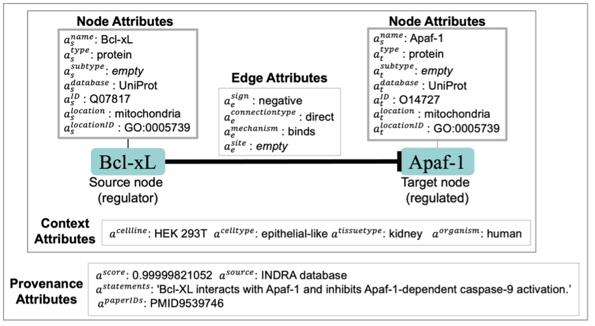
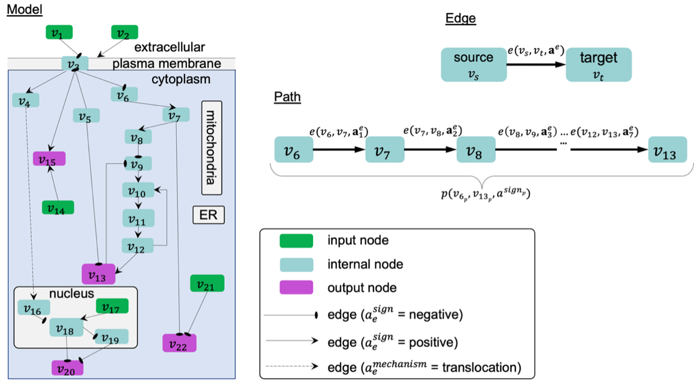

Welcome to BioRECIPE's documentation!
=======================================
.. image:: https://readthedocs.org/projects/melody-biorecipe/badge/?version=latest
    :target: https://melody-biorecipe.readthedocs.io/en/latest/?badge=latest
    :alt: Documentation Status

The BioRECIPE representation format was introduced to facilitate seamless human-machine interaction while creating, verifying, evaluating, curating, and expanding executable models of intra- and intercellular signaling when studying immune system and diseases. This format allows a human user to easily preview and modify any model components, while it is at the same time readable by machines and can be processed by a range of model development and analysis tools. The BioRECIPE format is a tabular format used for models that have a **directed** graph as their underlying structure.

Graph Structure and Attributes
----------------------------------
The components of a directed graph :math:`G(V,E)`, and the attributes of these components relevant for modeling intracellular networks, are defined as follows.

.. csv-table::
    :header: Notation, Definition
    :widths: 10, 60

    ":math:`V=\{v_1,v_2,...,v_N\}`", "a set of :math:`N` nodes :math:`v_i (i=1,...,N)`, each assigned to one model *element*, where each element represents a component of the system being modeled"
    ":math:`E=\{e_1,e_2,...,e_M\}`", "a set of :math:`M` directed edges :math:`e_j (j=1,...,M)`, each assigned to an *interaction* between elements"
    ":math:`v_i=v(\mathbf{a}_i^v)`", "each node :math:`v_i` has an attribute vector :math:`\mathbf{a}^v≡(a^{\mathrm{name}},a^{\mathrm{type}},a^{\mathrm{subtype}},a^{\mathrm{database}},a^{\mathrm{ID}},a^{\mathrm{location}},a^{\mathrm{locationID}})`"
    ":math:`e_j=e(V_{s_j},v_{t_j},\mathbf{a}_j^e)`", "each edge :math:`e_j` has one or more source nodes in a set :math:`V_{s_j}`, a target node :math:`v_{t_j}`, and an attribute vector :math:`\mathbf{a}^e≡(a^{\mathrm{sign}},a^{\mathrm{connectiontype}},a^{\mathrm{mechanism}},a^{\mathrm{site}},a^{\mathrm{cellline}},a^{\mathrm{celltype}},a^{\mathrm{tissuetype}},a^{\mathrm{organism}},a^{\mathrm{score}},a^{\mathrm{source}},a^{\mathrm{statements}},a^{\mathrm{paperIDs}})`"

Biological Interactions
----------------------------------
Here, we provide formal definitions of the components of a biological interaction, and the attributes of this components.

.. admonition:: Definition 1

 An element(node), :math:`v=v(\mathbf{a}^v)`, is defined by its name, type, and unique identifier (ID) and these attributes are written as a vector :math:`\mathbf{a}^v=(a^{\mathrm{name}},a^{\mathrm{type}},a^{\mathrm{ID}})`.

The attribute :math:`a^{\mathrm{name}}` is an element name, usually following the standard nomenclature used by biologists and in the literature (e.g., acronym ERK1 is used instead of a longer name “extracellular signal-regulated kinase 1”). The attribute :math:`a^{\mathrm{type}}` represents element type, usually genes, RNAs, proteins, chemicals, or biological processes. Biological entity names often have multiple synonyms (e.g., ERK1 may also be referred to as MAPK3), and therefore, unique identifiers (IDs) are used, which are stored in attribute :math:`a^{\mathrm{ID}}`. These IDs can be obtained from standard databases such as UniProt [5], PubChem [6], or the Gene Ontology Databases (GO) [7].

In addition to these three required attributes, the node attribute vector :math:`a^v` may also include other attributes that help describe the element. For example, attributes :math:`a^{\mathrm{location}}` and :math:`a^{\mathrm{locationID}}` hold information about the cellular compartment where the element is found and the compartment ID, respectively. We use the GO database to obtain these location IDs [7]. A subtype attribute, :math:`a^{\mathrm{subtype}}`, may be used to indicate additional type of an element, such as :math:`a^{\mathrm{subtype}}` = ``receptor`` for an element with :math:`a^{\mathrm{type}}` = ``protein``. Additionally, the unique ID attribute may be split into two attributes, the name of the database from which the ID is retrieved, :math:`a^{\mathrm{database}}`, and the ID, :math:`a^{\mathrm{ID}}`.

.. admonition:: Definition 2

 A directed signed interaction (also referred to as a directed edge) :math:`e=e(v_s,v_t,\mathbf{a}^e)` is defined with its source element :math:`v_s`, target element :math:`v_t`, and vector of attributes :math:`a^e`. The interaction attribute vector always includes at least the sign :math:`a^{\mathrm{sign}}` and connection type :math:`a^{\mathrm{connectiontype}}` attributes: :math:`\mathbf{a}^e=(a^{\mathrm{sign}},a^{\mathrm{connectiontype}})`. The direction of an interaction is always implicitly defined with source and target nodes, and therefore, not explicitly listed among its attributes.

The :math:`a^{\mathrm{sign}}` attribute indicates the sign (also referred to as polarity) of the influences, and it can take two values, :math:`a^{\mathrm{sign}}`= ``positive`` (e.g., activation) or :math:`a^{\mathrm{sign}}`= ``negative`` (e.g., inhibition). Sometimes, only the information about indirect influences on pathways of interest is known, and therefore, the attribute :math:`a^{\mathrm{connectiontype}}` is used to indicate whether the interaction :math:`e` is a direct physical interaction (:math:`a^{\mathrm{connectiontype}}` = ``direct``) or an indirect influence from the source node to the target node (:math:`a^{\mathrm{connectiontype}}` = ``indirect``). Since the interaction definition allows for indirect interactions, it is possible that source and target node are not in the same compartment, and this is the reason we assign the location attribute to nodes and not to the interaction.

The list of other attributes is not necessarily fixed; the components in it may vary, dependent on the goals of the analysis. A more specific information about the biological mechanism and the molecular site of an interaction can be included in the :math:`a^{\mathrm{mechanism}}` and the :math:`a^{\mathrm{site}}` attributes, respectively. We note here that, in some cases, :math:`a^{\mathrm{sign}}` is not explicitly stated in statements about influences that describe mechanisms (e.g., A phosphorylates B). In this case, it would be up to the user to either fill in this information from other sources or accept a default attribute assignment. For example, the default assignment could be ``positive`` for phosphorylation, although this may not always be the case, and would require curation. 

The edge attribute vector can also include the :math:`a^{\mathrm{cellline}}`, :math:`a^{\mathrm{celltype}}`, :math:`a^{\mathrm{tissuetype}}`, :math:`a^{\mathrm{organism}}` attributes, which hold the context information about the cell line, cell type, tissue type, and organism where the interaction is observed, respectively. 

Finally, provenance attributes can be used. The :math:`a^{\mathrm{score}}` attribute provides a summary score for confidence in the interaction, or the amount of available evidence for the interaction. The :math:`a^{\mathrm{source}}` attribute indicates the source of evidence, which can be literature, expert knowledge, databases, or data. The :math:`a^{\mathrm{statement}}` attribute is used to store the statements, parts of sentences or sentences where the interaction is mentioned. The :math:`a^{\mathrm{paperIDs}}` attribute holds paper IDs (e.g., PMCID [8]) where the sentences mentioning the interaction are found. When the information about the additional non-essential attributes is not available, these attributes are assigned an “empty” value.

In :numref:`figure_1`, we show an example biological interaction, with all node and edge attributes.

.. _figure_1:

    An example biological interaction represented as a directed signed edge between two nodes, including node, edge, context, and provenance attributes.

The table below summarizes the node and edge attributes in a directed graph :math:`G(V,E)`:

Representation of Individual Events and Interactions
------------------------------------------------------

The BioRECIPE format supports individual event and interaction representation for:

#. events that are retrieved in an automated manner by NLP-based machine readers
#. interactions found in interaction databases
#. interactions inferred from data
#. interactions entered manually by experts.

In the BioRECIPE format, a list of interactions is written such that each interaction is one row in a table (or a spreadsheet) and attributes are assigned to columns, as illustrated below:

Model Structure and Attributes
--------------------------------

Here, we provide a formal definition of a model structure and attributes, as well as a definition of a path.

.. admonition:: Definition 3

 The static structure of a model can be defined as a directed graph :math:`G(V,E)`, where :math:`V=\{v_1,v_2,...,v_N\}` is a set of nodes, and each node :math:`v_i=v(\mathbf{a}_i^v) (i=1,...,N)` is one model element, while :math:`E=\{e_1,e_2,...,e_M\}` is a set of directed edges, and an edge :math:`e_j=e(v_{s_j},v_{t_j},\mathbf{a}_j^e), (v_{s_j},v_{t_j}\in V,j=1,...,M)` indicates a directed interaction between elements :math:`v_{s_j}` and :math:`v_{t_j}`, in which source node :math:`v_{s_j}` influences target node :math:`v_{t_j}`. Vectors :math:`\mathbf{a}_i^v` and :math:`\mathbf{a}_j^e` are formed following the definitions of node and edge attribute vectors.

.. admonition:: Definition 4

 An input node is a node that is not a target node of any edge in the model, and an output node is a node that is not a source node of any edge in the model.

We also refer to input and output nodes as “hanging” from the rest of the model, and they are often important for modeling outcomes: input nodes are used as pathway catalysts, and output nodes can represent model outcomes.

.. admonition:: Definition 5

 We define a path in a model as :math:`n>1` connected edges: :math:`p(v_{s_p},v_{t_p},a^{\mathrm{sign}_p})=(e(v_{k_1}=v_{s_p},v_{k_2},\mathbf{a}_{k_1}^e),e(v_{k_2},v_{k_3},\mathbf{a}_{k_2}^e),...,e(v_{k_n},v_{k_{n+1}}=v_{t_p},\mathbf{a}_{k_n}^e))`. The direction of the path is implicitly defined with the source node :math:`v_{s_p}` and target node :math:`v_{t_p}`. The regulation sign :math:`a^{\mathrm{sign}_p}` is considered positive when the number of negative signs in the set :math:`\{a_{k_1}^{\mathrm{sign}},a_{k_2}^{\mathrm{sign}},...,a_{k_n}^{\mathrm{sign}}}` is even, and negative when this number is odd. Cycles and feedback loops may be defined in cases where the path source is also the path target, i.e., :math:`p(v_{s_p},v_{s_p},a^{\mathrm{sign}_p})`.

For example, in :numref:`figure_2`, on the path from source node :math:`v_6` to target node :math:`v_13`, the number of negative regulations is odd, due to only one negative regulation from node :math:`v_8` to :math:`v_9`, and so the sign of this overall path is negative.

.. _figure_2:

    A toy example of a model graph, showing input and output nodes, directed edges, paths, feedback and feedforward loops, and cellular compartments used for location. An edge example and a path example with notation details. (ER-endoplasmic reticulum)

Element-based Modeling Approach Definitions
--------------------------------------------

In element-based modeling of biological systems [30-33], an element represents a biomolecular species (and in some cases even a biological process) and all reactions that lead to changes in a single species are lumped together within the corresponding element’s update rule. Therefore, a model is a collection of element update rules, each update rule is associated with a different model element, which can be more formally defined as follows.

.. admonition:: Definition 6

 An element-based model is a triple :math:`\mathcal{M}(G,\mathcal{X},\mathcal{F})`, where :math:`G(V,E)` is a network structure of the model (defined earlier in Definition 3), :math:`\mathcal{X}=\{x_1,x_2,...,x_N\}` is a set of :math:`N` state variables corresponding to nodes in :math:`V=\{v_1,v_2,...,v_N\}`, and :math:`\mathcal{F}=\{f_1,f_2,...,f_N\}` is a set of :math:`N` regulatory (update) functions such that each element :math:`v_i \in V` has a corresponding function :math:`f_i \in \mathcal{F}`.

.. admonition:: Definition 7

 For each element :math:`v_i \in V`, its state variable :math:`x_i \in \mathcal{X}` can take any value from a set or an interval of values :math:`X_i`.

.. admonition:: Definition 8

 For each element :math:`v_i`, any element :math:`v_j` that influences the state of :math:`v_i` such that the function :math:`f_i` is sensitive to the value of :math:`x_j` is called a regulator of :math:`v_i`.

.. admonition:: Definition 9

 For each element :math:`v_i`, an influence set, denoted as :math:`V_i^{\mathrm{influence}} \in V`, consists of all regulators of :math:`v_i`. We will refer to the set of state variables that correspond to the elements in :math:`V_i^{\mathrm{influence}}` as :math:`\mathcal{X}_i^{\mathrm{influence}}`.

.. admonition:: Definition 10

 The next state of element :math:`v_i`, denoted as :math:`x_i^*`, is computed given current states of all elements in its influence set, that is, given values of all variables in :math:`\mathcal{X}_i^{\mathrm{influence}}`: :math:`x_i^*=f_i(\mathcal{X}_i^{\mathrm{influence}})`.

In general, functions in :math:`\mathcal{F}` can have different types, discrete or continuous, and moreover, individual elements within the same model could have very different update functions, thus forming hybrid models. The set or interval of possible values, :math:`X_i`, assigned to each model element :math:`x_i` can also vary. The function and element types are usually decided based on the knowledge or the information available about the modeled system and its components.

The element-based modeling approach can represent indirect influences between elements, and it can model systems where the knowledge about element interaction mechanisms is incomplete. Using element update rules in simulations allows for studies of cell dynamics, state transitions, and feedback loops [34, 35], and does not require full knowledge of the interaction mechanisms [36]. Element-based models can also allow for integration of both prior knowledge and data [13, 37, 38] and analysis of hybrid networks (systems involving protein-protein interactions, gene regulations, and/or metabolic pathways) [39].

An example of element-based models are discrete models, where each element state variable :math:`x_i` is assigned a discrete set of values [38]. Following Definition 7, :math:`x_i` can take any value from the set :math:`X_i:\{0,1,2,…,n_{i-1}\}`, where :math:`n_i` is the number of different states that element, :math:`v_i` can have. Often, these different states represent different levels of activity or concentration for element :math:`v_i`. Element update functions in discrete models can be of different type, some examples are ``min`` and ``max`` functions, and (rounded) weighted sums.

Boolean models are a subset of discrete models [29, 30, 40], where elements can have only two values, ``0`` (also referred to as OFF or False) or ``1`` (also referred to as ON or True). In Boolean models, value ``0`` represents states such as “inactive”, “absent”, or “low concentration” and value ``1`` represents states such as “active”, “present”, or “high concentration”. Element update functions in these models are Boolean functions where logic operators such as AND, OR, and NOT are used [31]. As an extension of Boolean networks, in the Probabilistic Boolean Network (PBN), randomness is introduced by assigning multiple candidate Boolean functions to the variables. At each time step during simulation, one of element’s candidate functions is chosen at random to determine its state [41, 42].

Other examples of commonly used element-based models are Bayesian Networks [35, 43] and Dynamic Bayesian Networks [34]. Bayesian networks introduce probability distributions into the governing rules of elements, increasing the freedom in updating element states. Similar to Bayesian Networks are structural equation models (SEMs) [44].

Given that the element-based modeling approach can be used for indirect influences and it can abstract away from detailed reaction mechanisms, additional methods have been introduced to account for the timing in biological systems, rates at which elements change, or delays in element updating and delays in pathways [38].

Representation of Element-based Models
----------------------------------------

Although the BioRECIPE format can be used for the representation of a list of interactions, its main purpose is the representation of hybrid element-based models. For each element :math:`v_i \in V`, in model :math:`\mathcal{M}`, we define the following attributes that correspond to columns in the tabular format.

**All relevant attributes from** :math:`G(V,E)`

a. All element (node) attributes are included.

.. csv-table::
    :header: Attribute, Value Instances
    :widths: 10, 60

    ":math:`a^{\mathrm{name}}`", <element name>
    ":math:`a^{\mathrm{type}}`", ``protein`` | ``gene`` | ``chemical`` | ``RNA`` | ``protein family`` | ``biological process``
    ":math:`a^{\mathrm{subtype}}`", ``receptor`` | <subtype name>
    ":math:`a^{\mathrm{database}}`", ``UniProt`` | ``HGNC`` | ``PubChem`` | ``Ensembl`` | ``GENCODE`` | ``RefSeq`` | ``GO`` | ``MeSH``
    ":math:`a^{\mathrm{ID}}`", <unique identifier>
    ":math:`a^{\mathrm{location}}`", ``cytoplasm`` | ``cytosol`` | ``plasma membrane`` | ``nucleus`` | ``mitochondria`` | ``endoplasmic reticulum`` | ``extracellular``
    ":math:`a^{\mathrm{locationID}}`", ``0005737`` | ``0005829`` | ``0005886`` | ``0005634`` | ``0005739`` | ``0005783`` | ``0005576``

b. All context attributes are included (their values can be inherited or inferred from edges in graph :math:`G(V,E)` that have :math:`v_i` as a target node).

.. csv-table::
    :header: Attribute, Value Instances
    :widths: 10, 60

    ":math:`a^{\mathrm{cellline}}`", <cell line name>
    ":math:`a^{\mathrm{celltype}}`", <cell type name>
    ":math:`a^{\mathrm{tissuetype}}`", <tissue type name>
    ":math:`a^{\mathrm{organism}}`", <organism name>

c. All evidence attributes are included (their values can be inherited or inferred from edges in graph :math:`G(V,E)` that have :math:`v_i` as a target node).

.. csv-table::
    :header: Attribute, Value Instances
    :widths: 10, 60

    ":math:`a^{\mathrm{score}}`", <number>
    ":math:`a^{\mathrm{source}}`", ``expert`` | ``literature`` | ``database`` | ``data``
    ":math:`a^{\mathrm{statements}}`", <text>; <text>; <text>; ...; <text>
    ":math:`a^{\mathrm{paperIDs}}`", <PMCID | PMID>; <PMCID | PMID>; ...; <PMCID | PMID>

**Regulators**

d. A source node :math:`v_j` of an edge in graph :math:`G(V,E)` that has :math:`v_i` as a target node is called a regulator of :math:`v_i`.

e. An influence set of element :math:`v_i`, denoted as :math:`V_i^{\mathrm{influence}} \in V`, consists of all regulators of :math:`v_i`.

f. Source nodes of all edges in graph :math:`G(V,E)` that have :math:`v_i` as a target node and :math:`a^{\mathrm{sign}}`="+" will belong to the positive list of regulators of element :math:`v_i`, denoted as :math:`V_i^{\mathrm{influence},+} \in V_i^{\mathrm{influence}}`.

.. csv-table::
    :widths: 10, 60

    ":math:`a^{\mathrm{positivelist}}`", "<positive regulator 1>, <positive regulator 2>, ..., <positive regulator k>"

g. Source nodes of all edges in graph :math:`G(V,E)` that have :math:`v_i` as a target node and :math:`a^{\mathrm{sign}}`="-" will belong to the negative list of regulators of element :math:`v_i`, denoted as :math:`V_i^{\mathrm{influence},-} \in V_i^{\mathrm{influence}}`.

.. csv-table::
    :widths: 10, 60

    ":math:`a^{\mathrm{negativelist}}`", "<negative regulator 1>, <negative regulator 2>, ..., <negative regulator l>"

h. The set of state variables :math:`x_j` that correspond to elements in :math:`V_i^{\mathrm{influence}}` is referred to as :math:`X_i^{\mathrm{influence}}`.

i. The state variables :math:`x_j` that correspond to elements in :math:`V_i^{\mathrm{influence},+}` form set :math:`X_i^{\mathrm{influence},+} \in X_i^{\mathrm{influence}}`, and are used for creating a positive regulations string for :math:`v_i`.

.. csv-table::
    :widths: 10, 60

    ":math:`a^{\mathrm{positiveregulationstring}}`", <string>

The rules for creating these positive regulation strings are written separately

j. The state variables :math:`x_j` that correspond to elements in :math:`V_i^{\mathrm{influence},-}` form set :math:`X_i^{\mathrm{influence},-} \in X_i^{\mathrm{influence}}`, and are used for creating a negative regulations string for :math:`v_i`.

.. csv-table::
    :widths: 10, 60

    ":math:`a^{\mathrm{negativeregulationstring}}`", <string>

The rules for creating these negative regulation strings are written separately

**Value-related attributes**

k. The state variable :math:`x_i \in \mathcal{X}` can represent either the amount or activity of :math:`v_i`.

.. csv-table::
    :widths: 10, 60

    ":math:`a^{\mathrm{valuetype}}`", ``amount`` | ``activity``

l. The state variable :math:`x_i \in \mathcal{X}` can take any value from a given set, or interval, of values :math:`X_i`. When :math:`X_i` is a set of discrete values, :math:`\left |X_i\left |` is referred to as the number of levels of :math:`v_i`.

.. csv-table::
    :widths: 10, 60

    ":math:`a^{\mathrm{levels}}`", <number of distinct levels> | ``inf``

m. State list is an array of k states :math:`(x_i^{t_0},x_i^{t_1},x_i^{t_2},...,x_i^{t_{k-1}})` that are assigned to :math:`v_i` at time steps :math:`(t_0,t_1,t_2,…,t_{k-1})` during simulation

.. csv-table::
    :widths: 10, 60

    ":math:`a^{\mathrm{statelist}}`", "<value>,<value>[time],...,<value>[time]"

n. When the state variable :math:`x_i` has a constant 0 value throughout the entire simulation, it is a constant OFF state.

.. csv-table::
    :widths: 10, 60

    ":math:`a^{\mathrm{constOFF}}`", empty | :math:`\checkmark`

o. When the state variable :math:`x_i` has a constant non-0 value (e.g., highest value from :math:`X_i`) throughout the entire simulation, it is a constant ON state.

.. csv-table::
    :widths: 10, 60

    ":math:`a^{\mathrm{constON}}`", empty | :math:`\checkmark`

p. Increment :math:`\Delta x_i` by which the state of :math:`v_i` can change in consecutive steps during simulation.

.. csv-table::
    :widths: 10, 60

    ":math:`a^{\mathrm{increment}}`", ":math:`\Delta \mathrm{value}`"

**Timing related attributes**

These attributes are used in simulations and discussed in detail separately.

q. Spontaneous behavior

r. Balancing behavior

s. Delay

t. Update group

u. Update rate

v. Update rank

The BioRECIPE format supports several different model representation schemes, ranging from less detailed to more detailed, from static graph attributes to dynamic attributes and parameters necessary for analysis of dynamic behaviors, as illustrated in the table below:

Acknowledgements
------------------

Many previous and current members of MeLoDy Lab have contributed to the brainstorming and development of the BioRECIPE format. The format has gone through several versions and revisions.

The first version of the BioRECIPE format was developed by Dr. Khaled Sayed, Dr. Cheryl Telmer, Adam Butchy, and Dr. Natasa Miskov-Zivanov, and it was presented at the Machine Learning, Optimization, and Big Data (MOD) conference, where it received the Best Paper Award.

The current version of the BioRECIPE format has been developed thanks to the additional efforts of Dr. Kara Bocan, Dr. Casey Hansen, Emilee Holtzapple, Gaoxiang Zhou, Difei Tang, Dr. Yasmine Ahmed, and Stefan Andjelkovic.

The authors of this document are Dr. Natasa Miskov-Zivanov, Dr. Casey Hansen, Gaoxiang Zhou, and Emilee Holtzapple.

The BioRECIPE format is compatible with the MeLoDy Lab tools, DiSH simulator, FLUTE, VIOLIN, CLARINET, ACCORDION, FIDDLE, PIANO, and it has been used for modeling, simulation, and analysis of T cells, CAR T cells, macrophages, melanoma cells, pancreatic cancer cells, glioblastoma multiforme stem cells, colon cancer cells, and ovarian cells.

.. toctree::
   :maxdepth: 2
   :caption: Contents

   Legal
