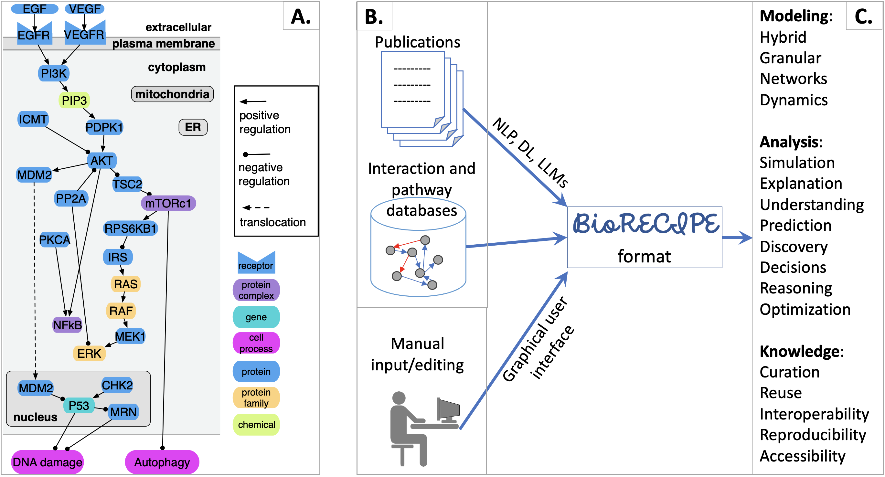

Welcome to BioRECIPE's documentation!
=======================================
.. image:: https://readthedocs.org/projects/melody-biorecipe/badge/?version=latest
    :target: https://melody-biorecipe.readthedocs.io/en/latest/?badge=latest
    :alt: Documentation Status

BioRECIPE: Biological system Representation for Evaluation, Curation, Interoperability, Preserving, and Execution
--------------------------------------------------------------------------------------------------------

The BioRECIPE representation format was introduced to facilitate seamless human-machine interaction while creating, verifying, evaluating, curating, and expanding *executable models* of intra- and intercellular signaling. This format allows a human user to easily preview and modify any model components, while it is at the same time readable by machines and can be processed by a range of model development and analysis tools. The BioRECIPE format is a tabular format used for models that have a *directed graph* as their underlying structure.

A small example of a signaling network that can be represented with the BioRECIPE format (A). Information and data sources for BioRECIPE (B). BioRECIPE format use in modeling and analysis (C).

|

The BioRECIPE format can be used to represent (1) `lists of interactions <https://melody-biorecipe.readthedocs.io/en/latest/index.html#id8>`_ and (2) `models <https://melody-biorecipe.readthedocs.io/en/latest/index.html#id9>`_ , as shown in the examples below. The details for all interaction attributes used in interaction lists can be found `here <https://melody-biorecipe.readthedocs.io/en/latest/bio_interactions.html#interaction-attributes>`_, and the details for additional element attributes used to represent executable models can be found here. 

|

.. csv-table:: Example interaction lists in the BioRECIPE format
    :header: Name, BioRECIPE representation
    :widths: 30, 70

    Reading output example, <link to example>

|

.. csv-table:: Example models in the BioRECIPE format
    :header: System, BioRECIPE representation, Publication 
    :widths: 30, 30, 40
    
    T cell, <link to BioRECIPE file>, `link <https://scholar.google.com/citations?view_op=view_citation&hl=en&user=tUrAYVsAAAAJ&citation_for_view=tUrAYVsAAAAJ:3fE2CSJIrl8C>`_ 
    CAR T cell, <link to BioRECIPE file>, `link <https://www.nmzlab.pitt.edu/research>`_ 
    macrophage, <link to BioRECIPE file>, `link <https://www.nmzlab.pitt.edu/research>`_ 
    melanoma, <link to BioRECIPE file>, `link <https://www.nmzlab.pitt.edu/research>`_ 
    pancreatic cancer cell, <link to BioRECIPE file>, `link <https://www.nmzlab.pitt.edu/research>`_ 
    GBM stem cell, <link to BioRECIPE file>, `link <https://www.nmzlab.pitt.edu/research>`_ 
    colon cancer cell, <link to BioRECIPE file>, `link <https://www.nmzlab.pitt.edu/research>`_ 
    ovarian cancer cell, <link to BioRECIPE file>, `link <https://www.nmzlab.pitt.edu/research>`_

|

Compatibility and Translators
-----------------------------

The BioRECIPE format is currently compatible with the following representation formats. 

.. csv-table:: Representation Format Compatibility
    :header: Format Name, Translator
    :widths: 10, 90

    SBML, <link to translator>
    JSON, <link to translator>
    other, <link to translator>

The BioRECIPE format is currently compatible with the following tools, their inputs and/or outputs.

.. csv-table:: Tool Compatibility
    :header: Tool Name, Translator to BioRECIPE, Translator from BioRECIPE 
    :widths: 10, 45, 45

    REACH, <link to translator>, NA
    TRIPS, <link to translator>, NA
    INDRA, <link to translator>, NA
    `DiSH simulator <https://scholar.google.com/citations?view_op=view_citation&hl=en&user=tUrAYVsAAAAJ&citation_for_view=tUrAYVsAAAAJ:GFxP56DSvIMC>`_, compatible
    `FLUTE <https://melody-flute.readthedocs.io>`_, compatible
    `VIOLIN <https://theviolin.readthedocs.io>`_, compatible
    `CLARINET <https://theclarinet.readthedocs.io>`_, compatible
    `ACCORDION <https://accordion.readthedocs.io>`_, compatible 
    `FIDDLE <https://melody-fiddle.readthedocs.io/>`_, compatible 
    `PIANO <https://dl.acm.org/doi/10.1145/3233547.3233694>`_, compatible

Acknowledgements
---------------------

Many previous and current members of MeLoDy Lab have contributed to the brainstorming and development of the BioRECIPE format. The format has gone through several versions and revisions.

The first version of the BioRECIPE format was developed by Dr. Khaled Sayed, Dr. Cheryl Telmer, Adam Butchy, and Dr. Natasa Miskov-Zivanov, and it was presented at the Machine Learning, Optimization, and Big Data (MOD) conference, where it received the Best Paper Award.

The current version of the BioRECIPE format has been developed thanks to the additional efforts of Dr. Kara Bocan, Dr. Casey Hansen, Dr. Emilee Holtzapple, Gaoxiang Zhou, Difei Tang, Dr. Yasmine Ahmed, and Stefan Andjelkovic.

The authors of this documentation are Dr. Natasa Miskov-Zivanov, Gaoxiang Zhou, Dr. Emilee Holtzapple, and Difei Tang.

.. toctree::
   :maxdepth: 2
   :caption: Contents
 
   bio_interactions
   hybrid_ebm_def
   repre_model_biorecipe
   Legal
