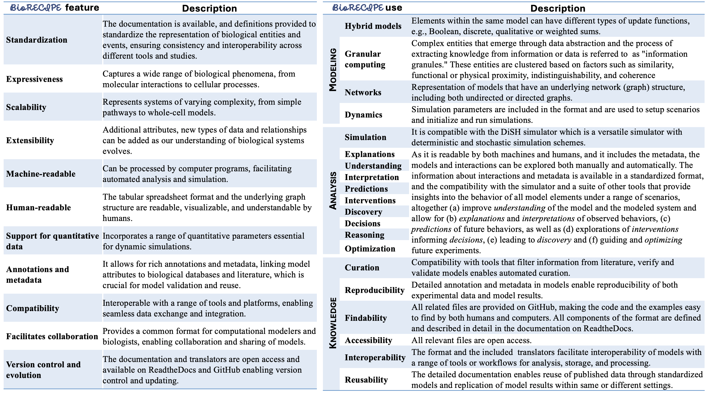

############
Introduction
############

The **BioRECIPE (Biological system Representation for Evaluation, Curation, Interoperability, Preserving, and Execution)** representation format was introduced to facilitate seamless human-machine interaction when creating, verifying, evaluating, curating, and expanding *executable models* of intra- and intercellular signaling. This format allows a human user to easily preview and modify any model component, while it is at the same time readable by machines and can be processed by a `suite <https://melody-biorecipe.readthedocs.io/en/latest/compatibility.html#compatibility-and-translators>`_ of model development and analysis tools. The BioRECIPE format is a tabular format most suitable for models that have a *directed graph* as their underlying structure.

Networks such as the one in the figure below (part A) can be represented with the BioRECIPE format. When creating interaction lists or models in the BioRECIPE format, information and data can be obtained from different sources, and input into BioRECIPE tables or spreadsheets automatically or manually (part B, left). Interaction lists and models written in the BioRECIPE format are convenient for different types of analysis and use (part B, right), either with automated tools, or manually, when human input is needed. (ER-endoplasmic reticulum)

.. figure:: figures/figure_BioRECIPE_overview_AB_March2024.png
    :align: center
    :alt: internal figure

|

The BioRECIPE format can be used to represent: 

    - *event-based* `lists of interactions <https://melody-biorecipe.readthedocs.io/en/latest/bio_interactions.html#interaction-lists>`_ 
    - *element-based* `models <https://melody-biorecipe.readthedocs.io/en/latest/model_representation.html#executable-models>`_ 

These two formats are shown in the examples below. In interaction list tables, each row corresponds to one interaction, and in model tables, each row corresponds to one model element. In these tables, columns correspond to various element and interaction attributes. The details of all interaction attributes used in interaction lists can be found `here <https://melody-biorecipe.readthedocs.io/en/latest/bio_interactions.html#interaction-lists>`_, and the details for additional element attributes used to represent executable models can be found `here <https://melody-biorecipe.readthedocs.io/en/latest/model_representation.html#executable-models>`_. 

|

.. csv-table:: Example interaction lists in the BioRECIPE format
    :header: Description, BioRECIPE representation, Notes 
    :widths: 20, 20, 60

    Example 1, `download <https://github.com/pitt-miskov-zivanov-lab/BioRECIPE/blob/main/examples/interaction_lists/RA_INDRA_st_biorecipe.xlsx>`_, 75K interactions from 6K papers obtained through INDRA[1]
    Example 2, `download <https://github.com/pitt-miskov-zivanov-lab/BioRECIPE/blob/main/examples/interaction_lists/RA_all_reading_biorecipe.xlsx>`_, 138K interactions from 6K papers obtained with REACH[2]
    Example 3, `download <https://github.com/pitt-miskov-zivanov-lab/BioRECIPE/blob/main/examples/interaction_lists/Reading_biorecipe.xlsx>`_, small interaction list example obtained from INDRA
    Example 4, `download <https://github.com/pitt-miskov-zivanov-lab/BioRECIPE/blob/main/examples/interaction_lists/interaction_biorecipe.xlsx>`_, small interaction list example obtained from REACH

[1] `INDRA <https://indra.readthedocs.io/en/latest/>`_

[2] `REACH <https://github.com/clulab/reach>`_

|

.. csv-table:: Example models in the BioRECIPE format
    :header: System, BioRECIPE representation, Publication 
    :widths: 30, 20, 50
    
    T cell, `download <https://github.com/pitt-miskov-zivanov-lab/BioRECIPE/blob/main/examples/models/BooleanTcell_biorecipe.xlsx>`_, `Tcell_SciSignal_2013 <https://scholar.google.com/citations?view_op=view_citation&hl=en&user=tUrAYVsAAAAJ&citation_for_view=tUrAYVsAAAAJ:3fE2CSJIrl8C>`_ 
    pancreatic cancer cell, `download <https://github.com/pitt-miskov-zivanov-lab/BioRECIPE/blob/main/examples/models/PCC_biorecipe.xlsx>`_, `AI4SynBio_2021 <https://www.biorxiv.org/content/10.1101/2021.06.08.447557v1.abstract>`_ 
    colon cancer cell, `download <https://github.com/pitt-miskov-zivanov-lab/BioRECIPE/blob/main/examples/models/CACC_biorecipe.xlsx>`_, `Cancer Immunology Research 2020 <https://aacrjournals.org/cancerimmunolres/article/8/2/167/469841/Cross-talk-between-Colon-Cells-and-Macrophages>`_ 
   

|

The tables below provide the description of BioRECIPE features and types of models that can be represented with BioRECIPE, model analysis that can be conducted on these models, and the descriptions of how BioRECIPE satisfies the FAIR principles.

|

Citation
---------

When using the BioRECIPE representation format, please cite the following:

  - Sayed, Khaled, et al., "Recipes for translating big data machine reading to executable cellular signaling models," Machine Learning, Optimization, and Big Data: Third International Conference, MOD 2017, Volterra, Italy, September 14–17, 2017, Revised Selected Papers 3. Springer International Publishing, 2018.
  - Holtzapple, Emilee, et al. "The BioRECIPE Knowledge Representation Format," bioRxiv, 2024.

|
