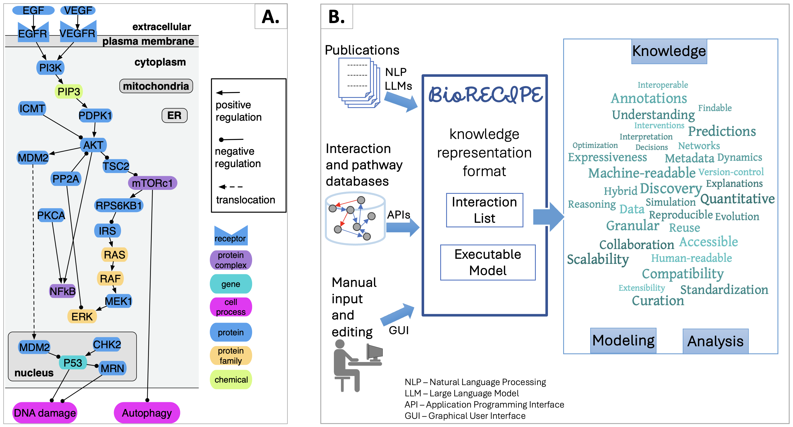

############
Introduction
############

The **BioRECIPE (Biological system Representation for Evaluation, Curation, Interoperability, Preserving, and Execution)** representation format was introduced to facilitate seamless human-machine interaction when creating, verifying, evaluating, curating, and expanding *executable models* of intra- and intercellular signaling. This format allows a human user to easily preview and modify any model component, while it is at the same time readable by machines and can be processed by a `suite <https://melody-biorecipe.readthedocs.io/en/latest/compatibility.html#compatibility-and-translators>`_ of model development and analysis tools. The BioRECIPE format is a tabular format most suitable for models that have a *directed graph* as their underlying structure.

Networks such as the one in the figure below (part A) can be represented with the BioRECIPE format. When creating interaction lists or models in the BioRECIPE format, information and data can be obtained from different sources, and input into BioRECIPE tables or spreadsheets automatically or manually (part B, left). Interaction lists and models written in the BioRECIPE format are convenient for different types of analysis and use (part B, right), either with automated tools, or manually, when human input is needed. (ER-endoplasmic reticulum)

|

The BioRECIPE format can be used to represent: 

    - *event-based* `lists of interactions <https://melody-biorecipe.readthedocs.io/en/latest/bio_interactions.html#interaction-lists>`_ 
    - *element-based* `models <https://melody-biorecipe.readthedocs.io/en/latest/model_representation.html#executable-models>`_ 

Examples
--------

A few examples of interaction lists are provided in the table below. In these examples, each row corresponds to one interaction and columns correspond to various interaction attributes. The details of all interaction attributes used in interaction lists can be found `here <https://melody-biorecipe.readthedocs.io/en/latest/bio_interactions.html#interaction-lists>`_, 

|

.. csv-table:: Example interaction lists in the BioRECIPE format
    :header: Description, BioRECIPE representation 
    :widths: 80, 20

    75K interactions from 6K papers obtained through `INDRA <https://indra.readthedocs.io/en/latest/>`_, `download <https://github.com/pitt-miskov-zivanov-lab/BioRECIPE/blob/main/examples/interaction_lists/RA_INDRA_st_biorecipe.xlsx>`_ 
    138K interactions from 6K papers obtained with `REACH <https://github.com/clulab/reach>`_, `download <https://github.com/pitt-miskov-zivanov-lab/BioRECIPE/blob/main/examples/interaction_lists/RA_all_reading_biorecipe.xlsx>`_
    small interaction list example obtained from INDRA, `download <https://github.com/pitt-miskov-zivanov-lab/BioRECIPE/blob/main/examples/interaction_lists/Reading_biorecipe.xlsx>`_
    small interaction list example obtained from REACH, `download <https://github.com/pitt-miskov-zivanov-lab/BioRECIPE/blob/main/examples/interaction_lists/interaction_biorecipe.xlsx>`_

|

A few examples of executable models are provided in the table below. In these examples, each row corresponds to one model element and columns correspond to various element, regulation, and context attributes. The details for these attributes used to represent executable models can be found `here <https://melody-biorecipe.readthedocs.io/en/latest/model_representation.html#executable-models>`_. 

|

.. csv-table:: Example models in the BioRECIPE format
    :header: System, BioRECIPE representation, Publication 
    :widths: 30, 20, 50
    
    T cell, `download <https://github.com/pitt-miskov-zivanov-lab/BioRECIPE/blob/main/examples/models/BooleanTcell_biorecipe.xlsx>`_, `Tcell_SciSignal_2013 <https://scholar.google.com/citations?view_op=view_citation&hl=en&user=tUrAYVsAAAAJ&citation_for_view=tUrAYVsAAAAJ:3fE2CSJIrl8C>`_ 
    pancreatic cancer cell, `download <https://github.com/pitt-miskov-zivanov-lab/BioRECIPE/blob/main/examples/models/PCC_biorecipe.xlsx>`_, `AI4SynBio_2021 <https://www.biorxiv.org/content/10.1101/2021.06.08.447557v1.abstract>`_ 
    colon cancer cell, `download <https://github.com/pitt-miskov-zivanov-lab/BioRECIPE/blob/main/examples/models/CACC_biorecipe.xlsx>`_, `Cancer Immunology Research 2020 <https://aacrjournals.org/cancerimmunolres/article/8/2/167/469841/Cross-talk-between-Colon-Cells-and-Macrophages>`_ 
   
|

BioRECIPE features and use
--------------------------

The tables below provide the description of BioRECIPE features and types of models that can be represented with BioRECIPE, model analysis that can be conducted on these models, and the descriptions of how BioRECIPE satisfies the FAIR principles.

|

.. csv-table:: BioRECIPE features
    :header: Feature, Description 
    :widths: 30, 70

    Standardization, "The documentation is available, and definitions provided to standardize the representation of biological entities and events, ensuring consistency and interoperability across different tools and studies."
    Expressiveness, "Captures a wide range of biological phenomena, from molecular interactions to cellular processes."
    Scalability, "Represents systems of varying complexity, from simple pathways to whole-cell models."
    Extensibility, "Additional attributes, new types of data and relationships can be added as our understanding of biological systems evolves."
    Machine-readable, "Can be processed by computer programs, facilitating automated analysis and simulation."
    Human-readable, "The tabular spreadsheet format and the underlying graph structure are readable, visualizable, and understandable by humans."
    Support for quantitative data, "Incorporates a range of quantitative parameters essential for dynamic simulations."
    Annotations and metadata, "It allows for rich annotations and metadata, linking model attributes to biological databases and literature, which is crucial for model validation and reuse."
    Compatibility, "Interoperable with a range of tools and platforms, enabling seamless data exchange and integration."
    Facilitates collaboration, "Provides a common format for computational modelers and biologists, enabling collaboration and sharing of models."
    Version control and evolution, "The documentation and translators are open access and available on ReadtheDocs and GitHub enabling version control and updating."

|

.. csv-table:: BioRECIPE use - Modeling
    :header: Modeling aspect, Description 
    :widths: 30, 70

    Hybrid models, "Elements within the same model can have different types of update functions, e.g., Boolean, discrete, qualitative or weighted sums."
    Granular computing, "Complex entities that emerge through data abstraction and the process of extracting knowledge from information or data is referred to  as information granules. These entities are clustered based on factors such as similarity, functional or physical proximity, indistinguishability, and coherence."
    Networks, "Representation of models that have an underlying network (graph) structure, including both undirected or directed graphs."
    Dynamics, "Simulation parameters are included in the format and are used to setup scenarios and initialize and run simulations."

.. csv-table:: BioRECIPE use - Analysis
    :header: Analysis type, Description 
    :widths: 30, 70

    Simulation, "It is compatible with the DiSH simulator which is a versatile simulator with deterministic and stochastic simulation schemes."
    "Explanations,Understanding, Interpretation, Predictions, Interventions, Discovery, Decisions, Reasoning, Optimization", "As it is readable by both machines and humans, and it includes the metadata, the models and interactions can be explored both manually and automatically. The information about interactions and metadata is available in a standardized format, and the compatibility with the simulator and a suite of other tools that provide insights into the behavior of all model elements under a range of scenarios, altogether (a) improve understanding of the model and the modeled system and allow for (b) explanations and interpretations of observed behaviors, (c) predictions of future behaviors, as well as (d) explorations of interventions informing decisions, (e) leading to discovery and (f) guiding and optimizing future experiments."

.. csv-table:: BioRECIPE use - Knowledge
    :header: FAIR aspect, Description 
    :widths: 30, 70

    Curation, "Compatibility with tools that filter information from literature, verify and validate models enables automated curation."
    Reproducibility, "Detailed annotation and metadata in models enable reproducibility of both experimental data and model results."
    Findability, "All related files are provided on GitHub, making the code and the examples easy to find by both humans and computers. All components of the format are defined and described in detail in the documentation on ReadtheDocs."
    Accessibility, "All relevant files are open access."
    Interoperability, "The format and the included  translators facilitate interoperability of models with a range of tools or workflows for analysis, storage, and processing."
    Reusability, "The detailed documentation enables reuse of published data through standardized models and replication of model results within same or different settings."
