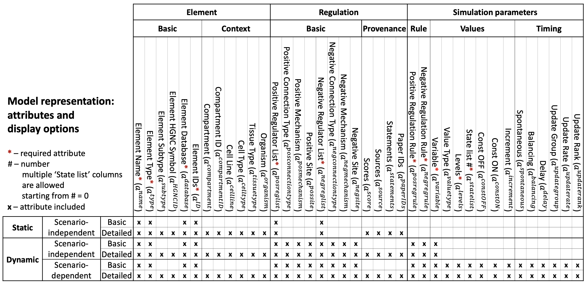

#################
Executable models
#################

The BioRECIPE format supports representation of the static graph structure of models, as well as attributes necessary to study the dynamics. Models are represented in the BioRECIPE format using *element-based* approach.

A toy example of a model graph, including input and output nodes, directed edges, paths, feedback and feedforward loops, and cellular compartments is shown in the `introduction <https://melody-biorecipe.readthedocs.io/en/latest/introduction.html#introduction>`_. 

Model formats
-------------

In the BioRECIPE format, as part of model representation, each element in a model is assigned a row in the model table/spreadsheet. Different from *event-based* representation of `interactions <https://melody-biorecipe.readthedocs.io/en/latest/bio_interactions.html#interaction-representation>`_, in this *element-based* representation multiple interactions can be combined as part of element update rules. The BioRECIPE format supports several different model representation schemes, ranging from less detailed to more detailed, from static graph attributes to dynamic attributes and parameters necessary for analysis of dynamic behaviors, as illustrated in the table below (X indicates attributes included in the scheme):

|
 

Besides the `basic <https://melody-biorecipe.readthedocs.io/en/latest/bio_interactions.html#basic-element-attributes>`_ element (node) attributes, `context <https://melody-biorecipe.readthedocs.io/en/latest/bio_interactions.html#context-attributes>`_ and `provenance <https://melody-biorecipe.readthedocs.io/en/latest/bio_interactions.html#provenance-attributes>`_ are inherited from the interactions in which the element participates, and they are included in the element representation. Additionally, several more attributes are included in executable models to define rules for element state changes and element parameters: 

- element regulation attributes
- element value attributes
- element timing attributes 

The following tables provide details for each attribute, including attribute name used in the BioRECIPE spreadsheet, a symbol used in `detailed definitions <https://melody-biorecipe.readthedocs.io/en/latest/definitions.html#formal-definitions>`_, a brief description of the attribute, its allowed values, and a few examples for the attribute. Model examples can be found `here <https://github.com/pitt-miskov-zivanov-lab/BioRECIPE/blob/main/examples>`_.

|

Element regulation attributes
-----------------------------

.. csv-table:: 
    :header: Attribute, Symbol, Description, Values, Examples
    :widths: 5, 3, 34, 38, 20

    Positive regulators list, ":math:`a^{\mathrm{posreglist}}`", description, "<positive regulator 1>, <positive regulator 2>, ..., <positive regulator :math:`k`>", examples
    Negative regulators list, ":math:`a^{\mathrm{negreglist}}`", description, "<negative regulator 1>, <negative regulator 2>, ..., <negative regulator :math:`l`>", examples
    Positive regulation rule, ":math:`a^{\mathrm{posregrule}}`", description, "<string>  //The rules for creating these positive regulation strings are written separately.", examples
    Negative regulation rule, ":math:`a^{\mathrm{negregurule}}`", description, "<string>  //The rules for creating these negative regulation strings are written separately.", examples

|

Element value attributes
------------------------

.. csv-table:: 
    :header: Attribute, Symbol, Description, Values, Examples
    :widths: 5, 3, 34, 38, 20
    
    Variable, ":math:`a^{\mathrm{variable}}`", description, <variable_name>, examples
    Value type, ":math:`a^{\mathrm{valuetype}}`", description, ``amount`` | ``activity``, examples
    Levels, ":math:`a^{\mathrm{levels}}`", description, <number of distinct levels> | ``inf``, examples
    State list, ":math:`a^{\mathrm{statelist}}`", description, "<value>,<value>[time],...,<value>[time]", examples
    Const OFF, ":math:`a^{\mathrm{constOFF}}`", description, empty | :math:`\checkmark`, examples
    Const ON, ":math:`a^{\mathrm{constON}}`", description, empty | :math:`\checkmark`, examples
    Increment, ":math:`a^{\mathrm{increment}}`", description, ":math:`\Delta \mathrm{value}`", examples

|

Timing attributes
-----------------

.. csv-table:: 
    :header: Attribute, Symbol, Description, Values, Examples
    :widths: 5, 3, 34, 38, 20

    Spontaneous, ":math:`a^{\mathrm{spontaneous}}`", description, `definition, examples
    Balancing, ":math:`a^{\mathrm{balancing}}`", description, `definition, examples
    Delay, ":math:`a^{\mathrm{delay}}`", description, `definition, examples
    Update group, ":math:`a^{\mathrm{updategroup}}`", description, `definition, examples
    Update rate, ":math:`a^{\mathrm{updaterate}}`", description, `definition, examples
    Update rank, ":math:`a^{\mathrm{updaterank}}`", description, `definition, examples

