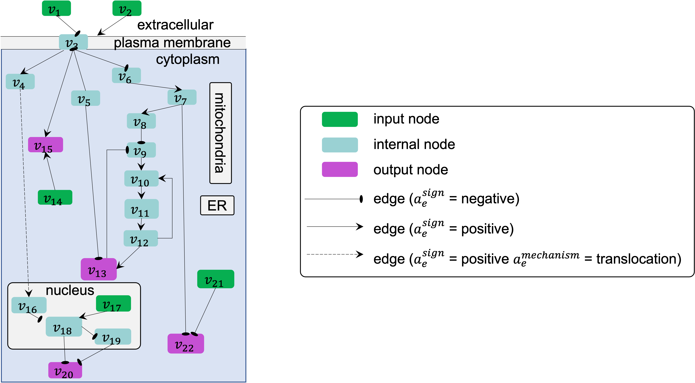

#####################
Model representation
#####################

The BioRECIPE format supports representation of the static `graph structure <https://melody-biorecipe.readthedocs.io/en/latest/model_representation.html#graph-structure>`_ of models, as well as the attributes necessary to study the dynamics. 

Graph structure
---------------

A toy example of a model graph, showing input and output nodes, directed edges, paths, feedback and feedforward loops, and cellular compartments is shown in the figure below. (ER-endoplasmic reticulum)

    

The components of a directed graph :math:`G(V,E)`, and the attributes of these components relevant for modeling intracellular networks, are defined as follows.

.. csv-table::
    :header: Notation, Definition
    :widths: 10, 90

    ":math:`V=\{v_1,v_2,...,v_N\}`", "a set of :math:`N` nodes :math:`v_i (i=1,...,N)`, each assigned to one model **element**, where each element represents a component of the system being modeled"
    ":math:`E=\{e_1,e_2,...,e_M\}`", "a set of :math:`M` directed edges :math:`e_j (j=1,...,M)`, each assigned to an **interaction** between elements"
    ":math:`v_i=v(\mathbf{a}_i^v)`", "each node :math:`v_i` has an attribute vector :math:`\mathbf{a}^v≡(a^{\mathrm{name}},a^{\mathrm{type}},a^{\mathrm{subtype}},a^{\mathrm{database}},a^{\mathrm{ID}},a^{\mathrm{compartment}},a^{\mathrm{compartmentID}})`"
    ":math:`e_j=e(V_{s_j},v_{t_j},\mathbf{a}_j^e)`", "each edge :math:`e_j` has one or more source nodes in a set :math:`V_{s_j}`, a target node :math:`v_{t_j}`, and an attribute vector :math:`\mathbf{a}^e≡(a^{\mathrm{sign}},a^{\mathrm{connectiontype}},a^{\mathrm{mechanism}},a^{\mathrm{site}},a^{\mathrm{cellline}},` :math:`a^{\mathrm{celltype}},a^{\mathrm{tissuetype}},a^{\mathrm{organism}},a^{\mathrm{score}},a^{\mathrm{source}},a^{\mathrm{statements}},a^{\mathrm{paperIDs}})`"

Element representation
----------------------

In the BioRECIPE format, as part of model representation, each element :math:`v_i \in V` in a model :math:`\mathcal{M}` is assigned a row in the model table/spreadsheet. Different from *event-based* representation of `interactions <https://melody-biorecipe.readthedocs.io/en/latest/bio_interactions.html#interaction-representation>`_, in this *element-based* representation multiple interactions can be combined as part of element update rules.

Besides the `basic <https://melody-biorecipe.readthedocs.io/en/latest/bio_interactions.html#id3>`_ element (node) attributes, `context <https://melody-biorecipe.readthedocs.io/en/latest/bio_interactions.html#id5>`_ and `provenance <https://melody-biorecipe.readthedocs.io/en/latest/bio_interactions.html#id6>`_ are inherited from the interactions in which the element participates, and they are included in the element representation. Additionally, several more attributes are included to define rules for element state changes (regulation attributes) and element state parameters (value and timing attributes) in executable models.

.. csv-table:: Regulation attributes
    :header: Attribute, Symbol, Description, Values, Examples
    :widths: 5, 3, 34, 38, 20

    Positive regulators list, ":math:`a^{\mathrm{poslist}}`", description, "<positive regulator 1>, <positive regulator 2>, ..., <positive regulator :math:`k`>", examples
    Negative regulators list, ":math:`a^{\mathrm{neglist}}`", description, "<negative regulator 1>, <negative regulator 2>, ..., <negative regulator :math:`l`>", examples
    Positive regulators, ":math:`a^{\mathrm{posregulation}}`", description, "<string>  //The rules for creating these positive regulation strings are written separately.", examples
    Negative regulators, ":math:`a^{\mathrm{negregulation}}`", description, "<string>  //The rules for creating these negative regulation strings are written separately.", examples

.. csv-table:: Value attributes
    :header: Attribute, Symbol, Description, Values, Examples
    :widths: 5, 3, 34, 38, 20

    Value Type, ":math:`a^{\mathrm{valuetype}}`", description, ``amount`` | ``activity``, examples
    Levels, ":math:`a^{\mathrm{levels}}`", description, <number of distinct levels> | ``inf``, examples
    State List, ":math:`a^{\mathrm{statelist}}`", description, "<value>,<value>[time],...,<value>[time]", examples
    Const OFF, ":math:`a^{\mathrm{constOFF}}`", description, empty | :math:`\checkmark`, examples
    Const ONN, ":math:`a^{\mathrm{constON}}`", description, empty | :math:`\checkmark`, examples
    Increment, ":math:`a^{\mathrm{increment}}`", description, ":math:`\Delta \mathrm{value}`", examples

.. csv-table:: Timing attributes
    :header: Attribute, Symbol, Description, Values, Examples
    :widths: 5, 3, 34, 38, 20

    Spontaneous, ":math:`a^{\mathrm{spontaneous}}`", description, `definition, examples
    Balancing, ":math:`a^{\mathrm{balancing}}`", description, `definition, examples
    Delay, ":math:`a^{\mathrm{delay}}`", description, `definition, examples
    Update Group, ":math:`a^{\mathrm{updategroup}}`", description, `definition, examples
    Update Rate, ":math:`a^{\mathrm{updaterate}}`", description, `definition, examples
    Update Rank, ":math:`a^{\mathrm{updaterank}}`", description, `definition, examples

Model formats
-------------

The BioRECIPE format supports several different model representation schemes, ranging from less detailed to more detailed, from static graph attributes to dynamic attributes and parameters necessary for analysis of dynamic behaviors, as illustrated in the table below:

.. figure:: figures/figure_BioRECIPE_model_format.png
    :align: center
    :alt: internal figure
