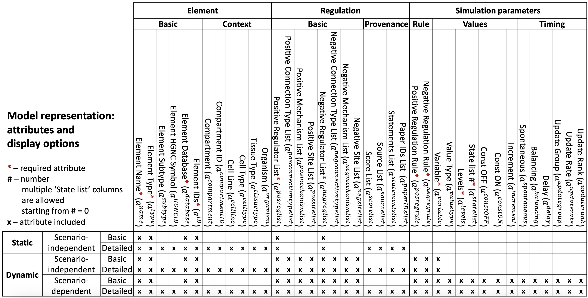

############################################################################
Representation of Hybrid Element-based Models in a BioRECIPE Spreadsheet
############################################################################

In the BioRECIPE format, each element :math:`v_i \in V` in a model :math:`\mathcal{M}` is assigned a row in the Model spreadsheet, and the column names in the spreadsheet are defined as listed in the table below.

All element (node), context and provenance attributes defined for interactions are also included for element :math:`v_i` and written following the same syntax rules. In addition to these attributes, additional attributes are used for :math:`v_i` in the model spreadsheet.

**Regulators-related attributes**

.. csv-table::
    :widths: 9, 40

    ":math:`a^{\mathrm{poslist}}`", "<positive regulator 1>, <positive regulator 2>, ..., <positive regulator :math:`k`>"
    ":math:`a^{\mathrm{neglist}}`", "<negative regulator 1>, <negative regulator 2>, ..., <negative regulator :math:`l`>"
    ":math:`a^{\mathrm{posregulation}}`", "<string>  //The rules for creating these positive regulation strings are written separately."
    ":math:`a^{\mathrm{negregulation}}`", "<string>  //The rules for creating these negative regulation strings are written separately."

**Value-related attributes**

.. csv-table::
    :widths: 9, 40

    ":math:`a^{\mathrm{valuetype}}`", ``amount`` | ``activity``
    ":math:`a^{\mathrm{levels}}`", <number of distinct levels> | ``inf``
    ":math:`a^{\mathrm{statelist}}`", "<value>,<value>[time],...,<value>[time]"
    ":math:`a^{\mathrm{constOFF}}`", empty | :math:`\checkmark`
    ":math:`a^{\mathrm{constON}}`", empty | :math:`\checkmark`
    ":math:`a^{\mathrm{increment}}`", ":math:`\Delta \mathrm{value}`"

**Timing related attributes**

These attributes are used in simulations and discussed in detail separately.

- Spontaneous behavior
- Balancing behavior
- Delay
- Update group
- Update rate
- Update rank

The BioRECIPE format supports several different model representation schemes, ranging from less detailed to more detailed, from static graph attributes to dynamic attributes and parameters necessary for analysis of dynamic behaviors, as illustrated in the table below:

The following text-formatted table might not be synced with the figure-formatted table.

+-------------------------------------------------------------------------+-------------------------------------------------------------------------------------------------------------------------------------------------------------------+--------------------------------------------------------------------------------------------------------------------------------------------------------------------------------------------------------------------------------------------------------------------------------------------------------------------+------------------------------------------------------------------------------------------------------------------------------------------------------------------------------------------------------------------------------------------------------------------------------------------------------------------------------------+-----------------------------------------------------------------------------------------------------------------------------------------------------------------------+-------------------------------------------------------------------------------------------+
| Model representation: attributes and display options                    |                                                                              Element                                                                              |                                                                                                                                                     Regulation                                                                                                                                                     |                                                                                                                                                        Simulation parameters                                                                                                                                                       |                                                                                Element                                                                                |                                         Regulation                                        |
|                                                                         +-------------------------------------------------------------------------------------------------------------------------------------------------------------------+----------------------------------------------------------------------------------------------------------------------------------------------------------+---------------------------------------------------------------------------------------------------------------------------------------------------------+---------------------------------------------------------------------------------------------------------------------------------------------------------+--------------------------------------------------------------------------------------------------------------------------------------------------------------------------+-----------------------------------------------------------------------------------------------------------------------------------------------------------------------+-------------------------------------------------------------------------------------------+
| * – required attribute                                                  |                                                                                Main                                                                               |                                                                         Positive                                                                         |                                                                         Negative                                                                        |                                                                          Values                                                                         |                                                                                  Timing                                                                                  |                                                                                Context                                                                                |                                         Provenance                                        |
| # – number, multiple State list columns are allowed starting from # = 0 +------------------------+------------------------+------------------------------+----------------------------+--------------------------------+--------------------+----------------------------------------+------------------------------------------------+-----------------------------------+----------------------------+---------------------------------------+------------------------------------------------+-----------------------------------+----------------------------+---------------------------+-------------------+-----------------------------+-------------------------+----------------------+--------------------------+------------------------------+--------------------------+-------------------+--------------------------------+-----------------------------+-----------------------------+-----------------------------+----------------------------------+------------------------+------------------------+----------------------------+-----------------------+-----------------+-------------------+---------------------------+-------------------------+
| x – included                                                            | Element Name*(a^name)  | Element Type*(a^type)  | Element Subtype (a^subtype)  | Element HGNC ID (a^HGNCID) | Element Database*(a^database)  | Element IDs*(a^ID) | Positive Regulators*(a^posregulators)  | Positive Connection Type (a^posconnectiontype) | PositiveMechanism(a^posmechanism) | Positive Site (a^possite)  | Negative Regulators*(a^negregulators) | Negative Connection Type (a^negconnectiontype) | NegativeMechanism(a^negmechanism) | Negative Site (a^negsite)  | Value Type (a^valuetype)  | Levels*(a^levels) | State list #*(a^statelist)  | Const OFF (a^constOFF)  | Const ON (a^constON) | Increment (a^increment)  | Spontaneous (a^spontaneous)  | Balancing (a^balancing)  | Delay (a^delay)   |  Update Group (a^updategroup)  | Update Rate (a^updaterate)  | Update Rank (a^updaterank)  | Compartment (a^compartment) | Compartment ID (a^compartmentID) | Cell Line (a^cellline) | Cell Type (a^celltype) | Tissue Type (a^tissuetype) | Organism (a^organism) | Score (a^score) | Source (a^source) | Statements (a^statements) | Paper IDs  (a^paperIDs) |
+===================+================================+====================+========================+========================+==============================+============================+================================+====================+========================================+================================================+===================================+============================+=======================================+================================================+===================================+============================+===========================+===================+=============================+=========================+======================+==========================+==============================+==========================+===================+================================+=============================+=============================+=============================+==================================+========================+========================+============================+=======================+=================+===================+===========================+=========================+
|       Static      |      Scenario-independent      |        Basic       |            x           |            x           |                              |                            |                x               |          x         |                    x                   |                                                |                                   |                            |                   x                   |                                                |                                   |                            |                           |                   |                             |                         |                      |                          |                              |                          |                   |                                |                             |                             |                             |                                  |                        |                        |                            |                       |                 |                   |                           |                         |
|                   |                                +--------------------+------------------------+------------------------+------------------------------+----------------------------+--------------------------------+--------------------+----------------------------------------+------------------------------------------------+-----------------------------------+----------------------------+---------------------------------------+------------------------------------------------+-----------------------------------+----------------------------+---------------------------+-------------------+-----------------------------+-------------------------+----------------------+--------------------------+------------------------------+--------------------------+-------------------+--------------------------------+-----------------------------+-----------------------------+-----------------------------+----------------------------------+------------------------+------------------------+----------------------------+-----------------------+-----------------+-------------------+---------------------------+-------------------------+
|                   |                                |      Detailed      |            x           |            x           |               x              |              x             |                x               |          x         |                    x                   |                        x                       |                 x                 |              x             |                   x                   |                        x                       |                 x                 |              x             |                           |                   |                             |                         |                      |                          |                              |                          |                   |                                |                             |                             |              x              |                 x                |            x           |            x           |              x             |           x           |        x        |         x         |             x             |            x            |
+-------------------+--------------------------------+--------------------+------------------------+------------------------+------------------------------+----------------------------+--------------------------------+--------------------+----------------------------------------+------------------------------------------------+-----------------------------------+----------------------------+---------------------------------------+------------------------------------------------+-----------------------------------+----------------------------+---------------------------+-------------------+-----------------------------+-------------------------+----------------------+--------------------------+------------------------------+--------------------------+-------------------+--------------------------------+-----------------------------+-----------------------------+-----------------------------+----------------------------------+------------------------+------------------------+----------------------------+-----------------------+-----------------+-------------------+---------------------------+-------------------------+
|      Dynamic      |      Scenario-independent      |        Basic       |            x           |            x           |                              |                            |                x               |          x         |                    x                   |                                                |                                   |                            |                   x                   |                                                |                                   |                            |                           |                   |                             |                         |                      |                          |                              |                          |                   |                                |                             |                             |                             |                                  |                        |                        |                            |                       |                 |                   |                           |                         |
|                   |                                +--------------------+------------------------+------------------------+------------------------------+----------------------------+--------------------------------+--------------------+----------------------------------------+------------------------------------------------+-----------------------------------+----------------------------+---------------------------------------+------------------------------------------------+-----------------------------------+----------------------------+---------------------------+-------------------+-----------------------------+-------------------------+----------------------+--------------------------+------------------------------+--------------------------+-------------------+--------------------------------+-----------------------------+-----------------------------+-----------------------------+----------------------------------+------------------------+------------------------+----------------------------+-----------------------+-----------------+-------------------+---------------------------+-------------------------+
|                   |                                |      Detailed      |            x           |            x           |               x              |              x             |                x               |          x         |                    x                   |                        x                       |                 x                 |              x             |                   x                   |                        x                       |                 x                 |              x             |                           |                   |                             |                         |                      |                          |                              |                          |                   |                                |                             |                             |              x              |                 x                |            x           |            x           |              x             |           x           |        x        |         x         |             x             |            x            |
|                   +--------------------------------+--------------------+------------------------+------------------------+------------------------------+----------------------------+--------------------------------+--------------------+----------------------------------------+------------------------------------------------+-----------------------------------+----------------------------+---------------------------------------+------------------------------------------------+-----------------------------------+----------------------------+---------------------------+-------------------+-----------------------------+-------------------------+----------------------+--------------------------+------------------------------+--------------------------+-------------------+--------------------------------+-----------------------------+-----------------------------+-----------------------------+----------------------------------+------------------------+------------------------+----------------------------+-----------------------+-----------------+-------------------+---------------------------+-------------------------+
|                   |       Scenario-dependent       |        Basic       |            x           |            x           |                              |                            |                x               |          x         |                    x                   |                                                |                                   |                            |                   x                   |                                                |                                   |                            |             x             |         x         |              x              |            x            |           x          |             x            |               x              |             x            |         x         |                x               |              x              |              x              |                             |                                  |                        |                        |                            |                       |                 |                   |                           |                         |
|                   |                                +--------------------+------------------------+------------------------+------------------------------+----------------------------+--------------------------------+--------------------+----------------------------------------+------------------------------------------------+-----------------------------------+----------------------------+---------------------------------------+------------------------------------------------+-----------------------------------+----------------------------+---------------------------+-------------------+-----------------------------+-------------------------+----------------------+--------------------------+------------------------------+--------------------------+-------------------+--------------------------------+-----------------------------+-----------------------------+-----------------------------+----------------------------------+------------------------+------------------------+----------------------------+-----------------------+-----------------+-------------------+---------------------------+-------------------------+
|                   |                                |      Detailed      |            x           |            x           |               x              |              x             |                x               |          x         |                    x                   |                        x                       |                 x                 |              x             |                   x                   |                        x                       |                 x                 |              x             |             x             |         x         |              x              |            x            |           x          |             x            |               x              |             x            |         x         |                x               |              x              |              x              |              x              |                 x                |            x           |            x           |              x             |           x           |        x        |         x         |             x             |            x            |
+-------------------+--------------------------------+--------------------+------------------------+------------------------+------------------------------+----------------------------+--------------------------------+--------------------+----------------------------------------+------------------------------------------------+-----------------------------------+----------------------------+---------------------------------------+------------------------------------------------+-----------------------------------+----------------------------+---------------------------+-------------------+-----------------------------+-------------------------+----------------------+--------------------------+------------------------------+--------------------------+-------------------+--------------------------------+-----------------------------+-----------------------------+-----------------------------+----------------------------------+------------------------+------------------------+----------------------------+-----------------------+-----------------+-------------------+---------------------------+-------------------------+
